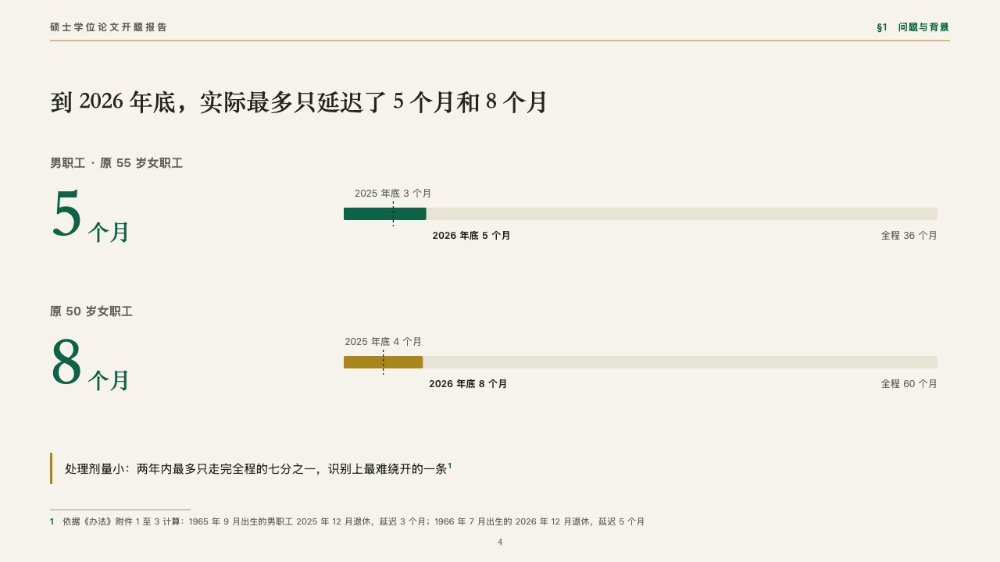
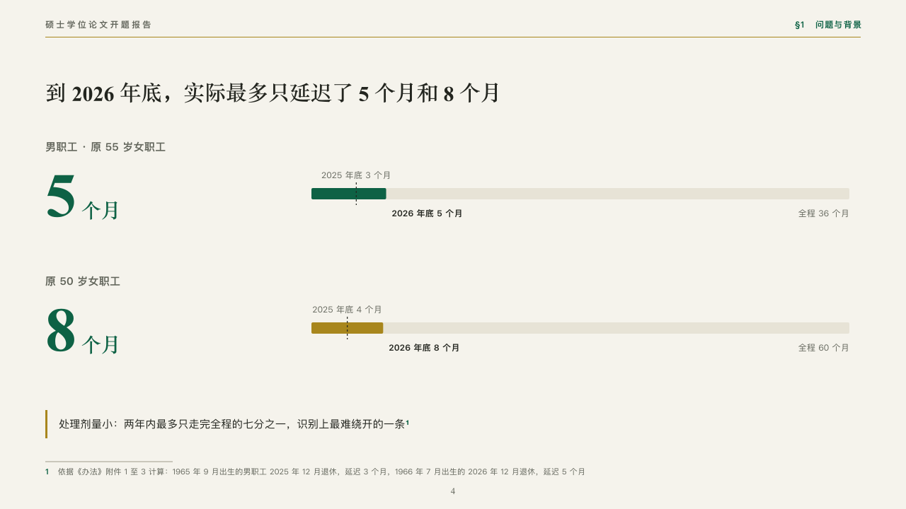

# reach

How far a measure has come against its whole.

Code: [`src/layouts/compositions/reach.tsx`](../../../src/layouts/compositions/reach.tsx). The header comment there is the contract. The manuscript setting only.

## thesis, retirement age thesis proposal sample, 2026-10

Settled on the dose page (p04). The round's decisions are in [rounds/2026-10-06-thesis](../../rounds/2026-10-06-thesis/README.md).

| board (p04) | engine |
| :-: | :-: |
|  |  |

**What it looks like.** A row a group: its name small in the grey, where it stands now set at 88px in emerald in the heading serif with its unit beside it, and a bar the whole way long filled to now, in emerald, gold or indigo a row, with a dashed tick where it stood at the earlier date. The three readings are named in 12px type, the earlier over the tick and the now and the whole under the bar. A closing line with a gold bar.

**Why.** Five months of a sixty-month rise is the constraint the whole design turns on. A bar of the whole filled to now shows how little of the reform has happened by the time the data can see it.

**What it gave up.**

- Takes an untitled horizontal `bar` chart of one to three categories and three series in order (the earlier reading, the reading now marked `emphasis`, the whole), then optionally a `callout`.
- A group's name or a closing line past one line, or a figure that would run into the bar, sends the page back.
