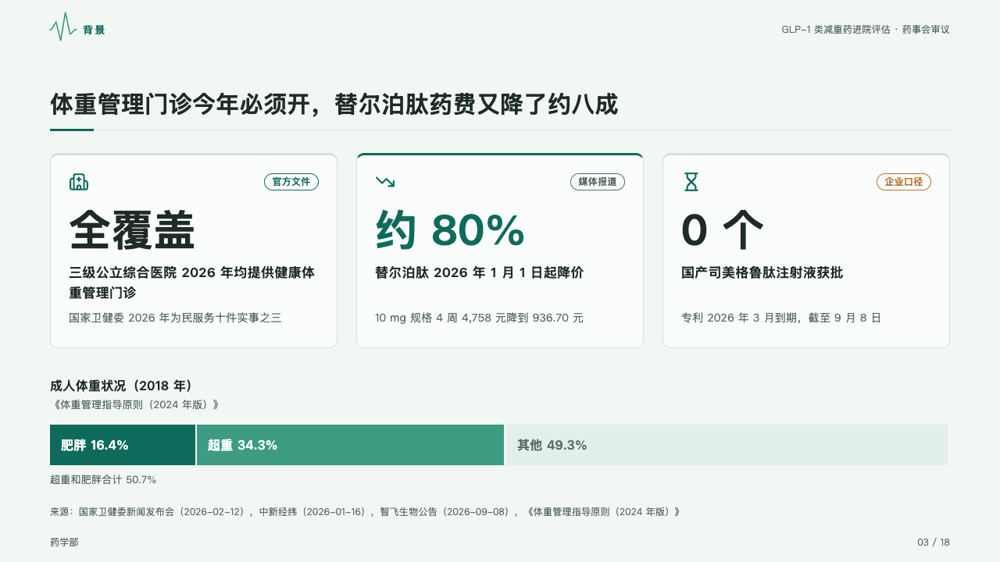
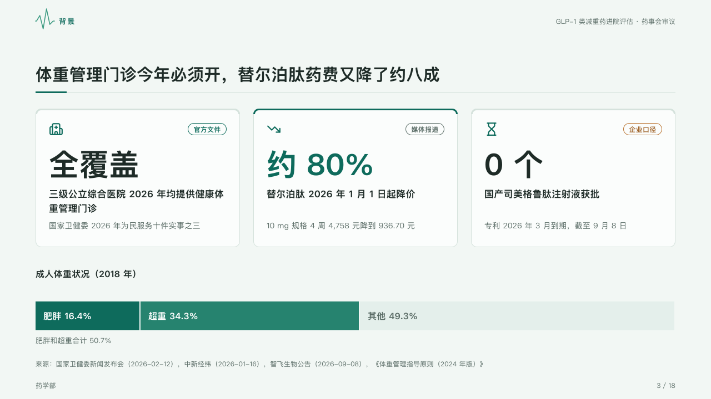

# readings

Why now, in two to four figures on cards, each naming the kind of source it rests on, over the whole they sit in as a share bar.

Code: [`src/layouts/compositions/readings.tsx`](../../../src/layouts/compositions/readings.tsx). The header comment there is the contract. The dossier setting only.

## clinic, GLP-1 formulary review sample, 2026-10

Settled on the background page (p03). The round's decisions are in [rounds/2026-10-05-clinic](../../rounds/2026-10-05-clinic/README.md).

| board (p03) | engine |
| :-: | :-: |
|  |  |

**What it looks like.** The figures stand on white cards 250px tall in a row, 10px down the band: each card its icon at the top left, the capsule naming its source at the top right (the item's `tag`, outlined in its kind's ink: 「官方文件」 in deep teal, 「媒体报道」 in grey, 「企业口径」 in brown), the figure bold at 54px, its label bold at 17px under it and its note muted at 14px under that. The figure the page argues from (`**…**` around its value) is in the mark, its card's top edge a 3px rule of the mark. Under the cards the share bar: the category's name bold over it, each part's name and share inside it, the marked parts (`emphasis` on their series) in the mark and then the accent stepped dark enough for white words, the rest on the mark's pale tint, and the marked parts' total under the bar (「肥胖和超重合计 50.7%」).

**Why.** A submission says first why the decision is due now, and each reason is only as good as where it comes from.

**What it gave up.**

- One `kpi_cards` of two to four items, each with an icon and none with a delta or a source, then optionally one share bar of two to four parts.
- A figure wider than its card, a label or note past two lines, or a part too narrow for its name and share sends the page back.
- The board's second line under the bar's caption (the figures' own source) is left to the page's source line.
