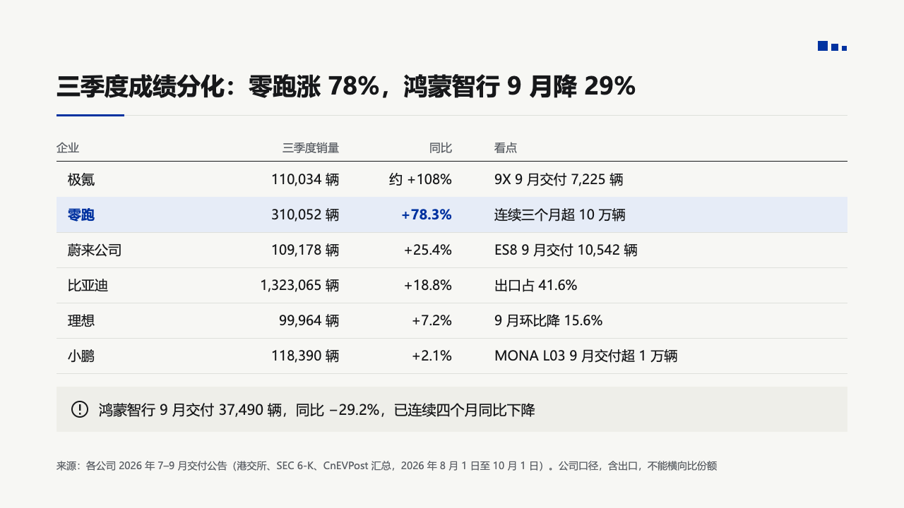
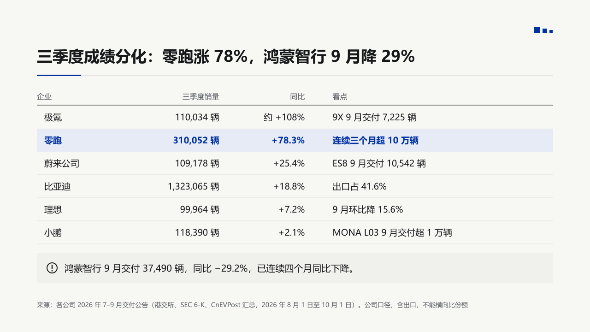
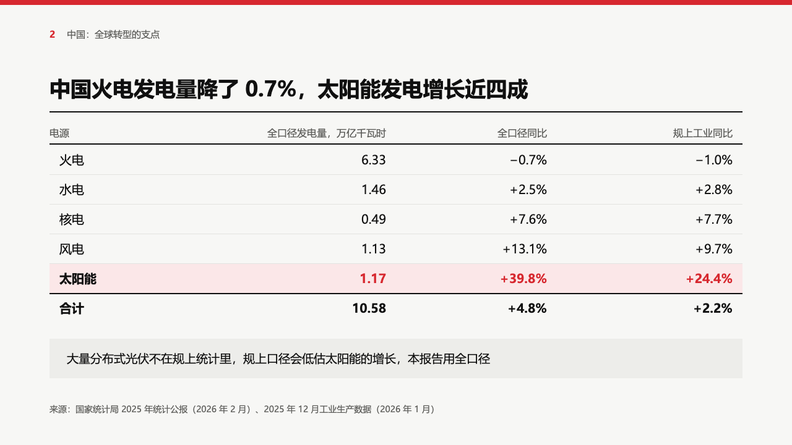
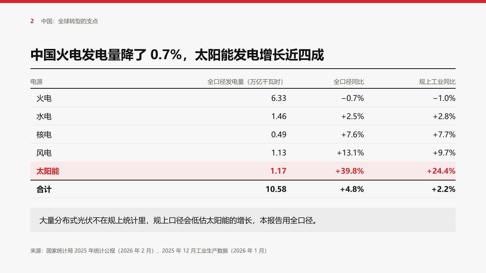
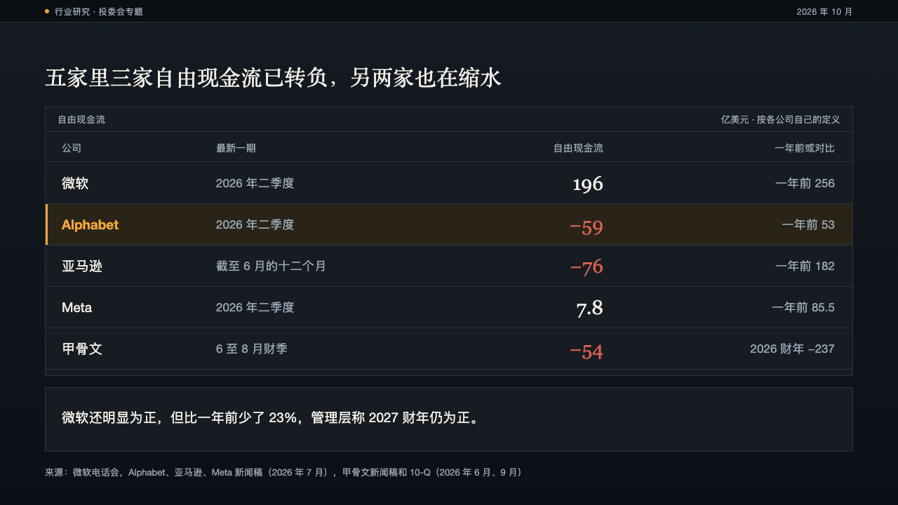
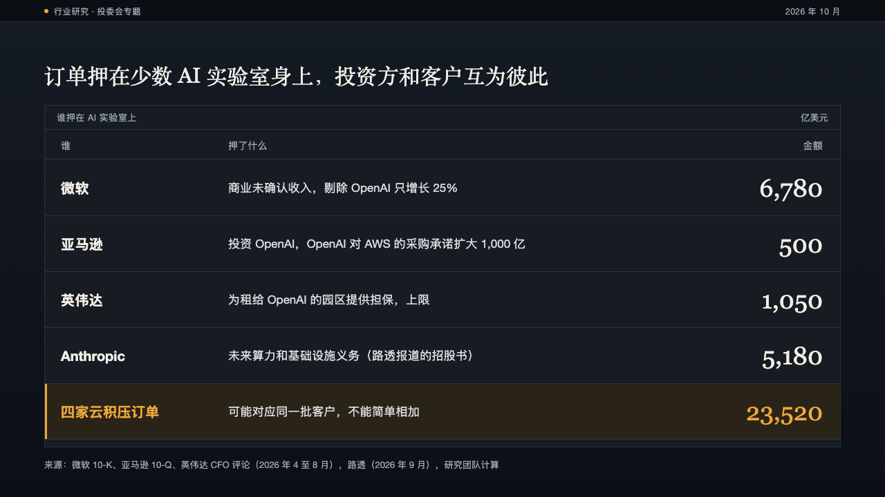
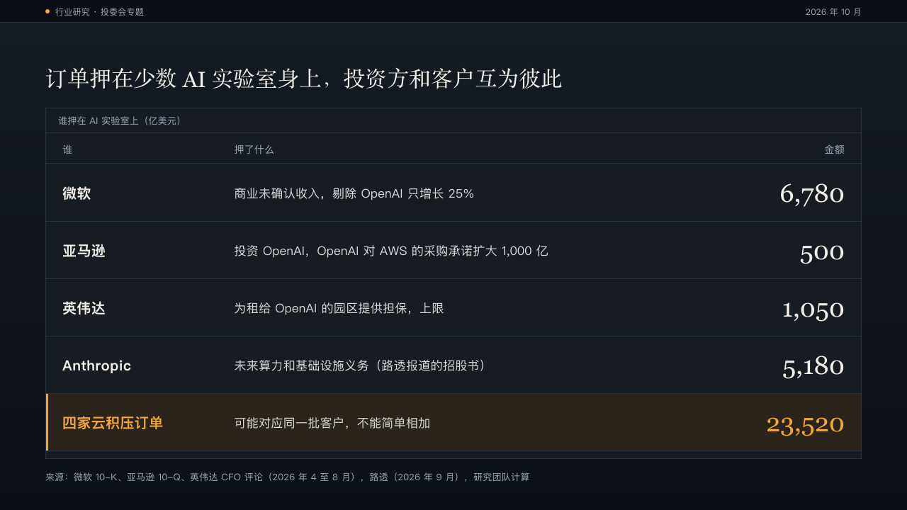

# records

A data table set open, the way a report prints one: small headers over a black rule, one 50px row per record, a highlighted row on a pale tint of the primary colour, and an optional note on a light panel under it.

Code: [`src/layouts/compositions/records.tsx`](../../../src/layouts/compositions/records.tsx). The closing panel is `paintNoticeClosing` in [`closing.tsx`](../../../src/layouts/compositions/closing.tsx).

## bulletin, NEV sample, 2026-10

Settled on the company table. The round's decisions are in [rounds/2026-10-03-bulletin](../../rounds/2026-10-03-bulletin/README.md).

| board (p07) | engine |
| :-: | :-: |
|  |  |

**What it looks like.** Headers at 16px muted, a black 1px rule under them, then rows 50px tall with cells at 19px on one line and a hairline under each row. The first column is inset 16px. Columns take their widest text and share the rest. The highlighted row (`emphasis: "highlight"`) sits on a pale primary tint with every cell bold in primary. A `warn` callout after the table becomes a light grey panel with a stroked circle and an exclamation mark before its words at 20px.

**Why.** Six companies and three facts each are a table, and a table reads best with nothing between the reader and the numbers. One tinted row says which company the page is about. The warning is a different kind of fact from the rows, so it gets its own panel instead of a seventh row.

**What it gave up.**

- Two to six columns, at most eight rows, every cell on one line.
- No `source` on the table itself: the page's source line is where a source goes.
- A highlighted row is IKB bold across every cell, where the board set the name and the change only.

## swiss, power sample, 2026-10

In the grid setting. The round's decisions are in [rounds/2026-10-03-swiss](../../rounds/2026-10-03-swiss/README.md).

| board (p09) | engine |
| :-: | :-: |
|  |  |

**What it looks like.** Headers at 16px muted over a 2px black rule, 48px rows of 20px cells with hairlines between them, a total row bold under a 2px black rule, and the highlighted row on a pale tint of the accent with every cell bold in the accent. A closing note 26px under the table on the light panel.

**What it gave up.**

- The board's red on its tint misses 4.5:1 by a little, so the row's text takes the least step of the accent toward black that reaches it: still red.
- The tint is the accent at 10% over the surface (`#FBEAEA` on swiss), where the board drew `#FBE7E8`.
- The closing note is 20px in a 64px panel, the size it is everywhere, where the board set 19px.

## ledger, AI capex sample, 2026-10

In the panel setting, settled on two pages. The round's decisions are in [rounds/2026-10-04-ledger](../../rounds/2026-10-04-ledger/README.md).

| board (p07) | engine |
| :-: | :-: |
|  |  |

| board (p10) | engine |
| :-: | :-: |
|  |  |

**What it looks like.** The table in a panel named by its `title`. Small muted headers over a hairline, then one row per record with a hairline under each. The first column names the record, the column of plain figures is set large in the heading face, right-aligned, a negative figure in red, and the other columns stay quiet at 17px. A highlighted row sits on a dark amber tint with a 3px amber bar down its left edge, its name bold in amber and its figure amber unless it is negative. The table takes the large size (80px rows, figures at 36px) when it fits with its note and the compact one (58px rows, figures at 28px) otherwise. A callout after it is a note panel under the table.

**Why.** A cash-flow table is read for the sign of each figure. Large serif figures with red for a negative make the three companies that turned negative the first thing seen, and the highlighted row is the one the page is about.

**What it gave up.**

- Two to six columns, one to eight rows, no `source` of its own. A cell past one line at its size declines.
- A table has no unit field, so its `title` carries the unit ("自由现金流（亿美元）").
