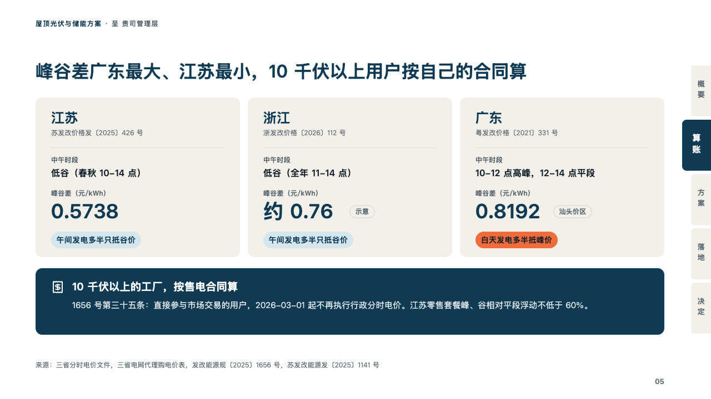
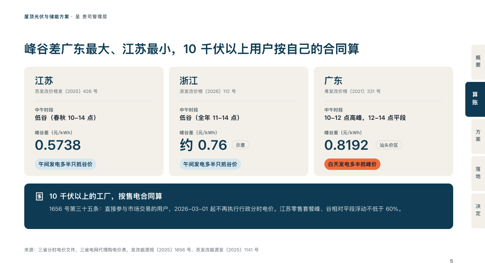

# regions

Places set side by side as cards, each with the figure a page is about.

Code: [`src/layouts/compositions/regions.tsx`](../../../src/layouts/compositions/regions.tsx). The header comment there is the contract. The binder setting only.

## proposal, rooftop solar and storage proposal sample, 2026-10

Settled on the three provinces page (p05). The round's decisions are in [rounds/2026-10-06-proposal](../../rounds/2026-10-06-proposal/README.md).

| board (p05) | engine |
| :-: | :-: |
|  |  |

**What it looks like.** A card of sand a place: its name at 24px in petrol, the document under it in small grey, a hairline, then each labelled row as its label in small grey over its value at 16px bold, and the marked row as its label over a figure at 36px in petrol, an aside in brackets on that figure set beside it as a grey chip (「约 0.76（示意）」). Last, the closing row as a verdict chip a card, petrol on the sky's tint, the one marked whole in the tangerine. Under the cards, the note as a block of petrol with its icon, its title bold and its text in white.

**Why.** The same rule reads differently by place. One card each, with the figure in the same spot, lets the reader compare across without a table.

**What it gave up.**

- Takes a `comparison` of two to four columns with no title, label column, tags, icons or recommendation, optionally a first row with no label, one to three labelled rows with exactly one marked, optionally a last row with no label, at most one of whose cells is marked whole, then optionally a `callout` with a title and no tag.
- A name past one line, a line, label or value past its card, a verdict wider than its card or a note past two lines sends the page back.
