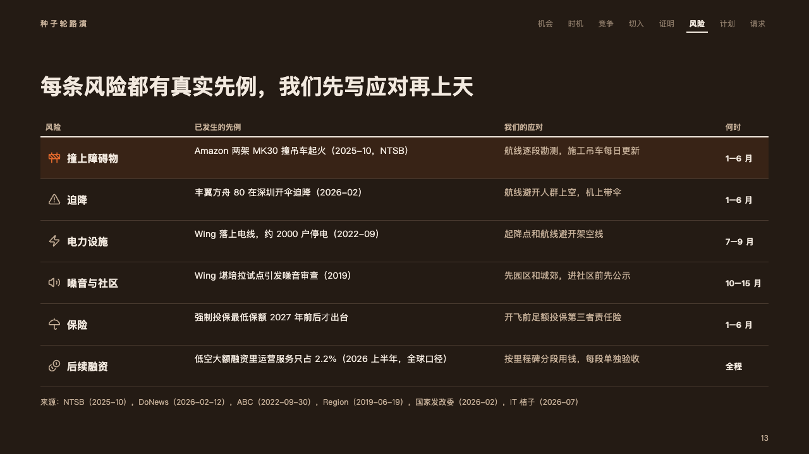
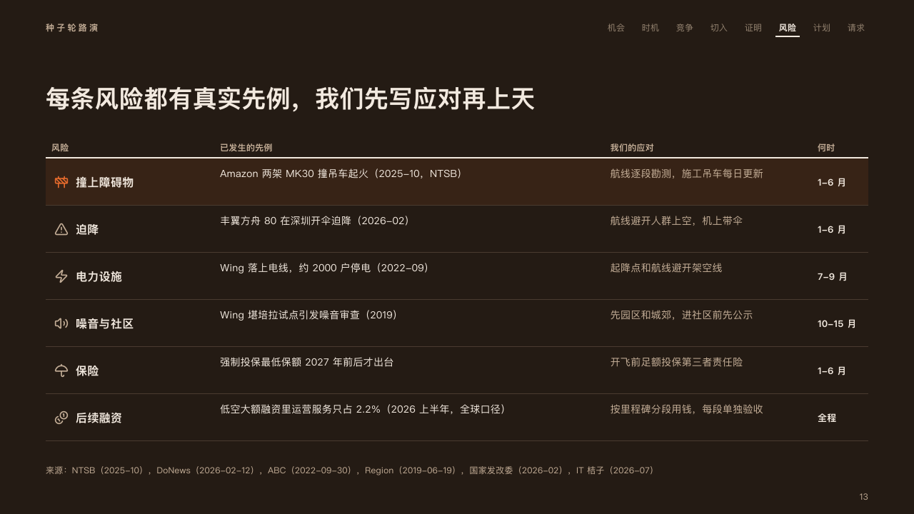

# register

A risk register: a row a risk with what has happened, the response and when, the one the page leads with on a tint of the fire.

Code: [`src/layouts/compositions/register.tsx`](../../../src/layouts/compositions/register.tsx). The header comment there is the contract. The pitch setting only.

## ember, low-altitude delivery pitch sample, 2026-10

Settled on the risks page (p13). The round's decisions are in [rounds/2026-10-06-ember](../../rounds/2026-10-06-ember/README.md).

| board (p13) | engine |
| :-: | :-: |
|  |  |

**What it looks like.** The columns' names at 12px bold in the warm grey over a 2px rule of the ivory. One row a risk, 66px tall: its icon, its name bold at 16px, then the columns between in up to two lines each, the first in the ivory and the next in the warm grey, and the short last column (when, who) bold. A dark rule between rows. The row the page leads with (`emphasis: "highlight"`) sits on the fire at 10% on the stage, its icon in the fire.

**Why.** Every risk in the sample has already happened to someone. A register that reads across, from what happened to what the startup does about it, shows the room the homework is done.

**What it gave up.**

- A `data_table` of three to five columns, none marked and none with an icon, two to six rows, at most one highlighted and none a total, no tags, no title or source.
- The name column takes a fifth of the band and a last column of 96px or less is set bold as the short column.
- A risk's name past one line, a cell past two lines of its column, or a column name past one line sends the page back.
