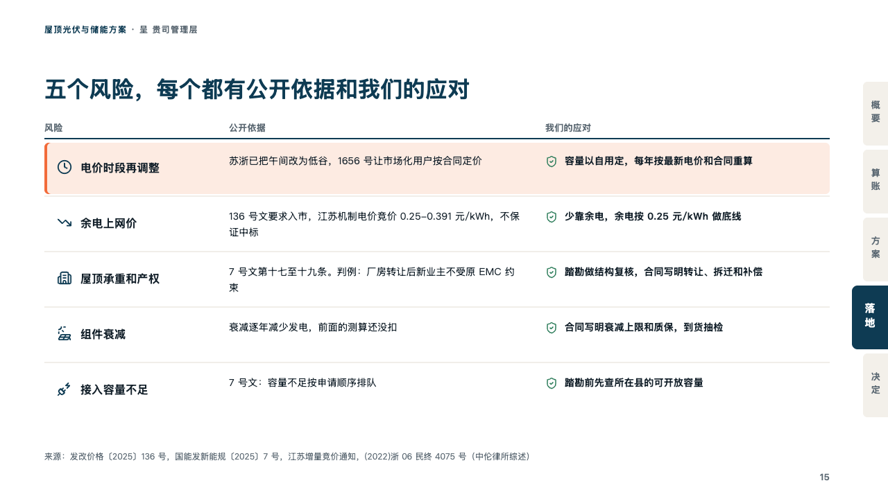
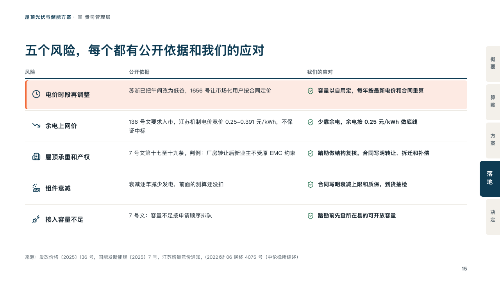

# remedies

A risk register: each risk, what the public record says, and the answer.

Code: [`src/layouts/compositions/remedies.tsx`](../../../src/layouts/compositions/remedies.tsx). The header comment there is the contract. The binder setting only.

## proposal, rooftop solar and storage proposal sample, 2026-10

Settled on the risks page (p15). The round's decisions are in [rounds/2026-10-06-proposal](../../rounds/2026-10-06-proposal/README.md).

| board (p15) | engine |
| :-: | :-: |
|  |  |

**What it looks like.** Three columns under their headers in small grey and a 2px rule of petrol. A row a risk: its icon in petrol and its name bold, what the public record says, and the answer bold after the column's shield in the success ink. The risk the page leads with (a row marked `highlight`) sits on the tangerine's tint with a tangerine edge at its left. Hairlines between the rows.

**Why.** Every risk a client can name already has a public source. Pairing each one with that source and with the supplier's answer turns an objection into a line the contract can carry.

**What it gave up.**

- Takes a `data_table` of three columns, the last with an icon, no title, source or marked column, and two to five rows each with an icon, no tag or total, at most one marked `highlight`.
- A name past one line, or a record or an answer past two lines sends the page back.
