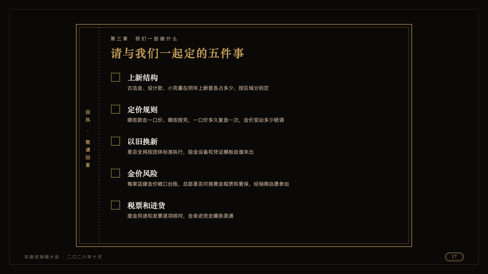
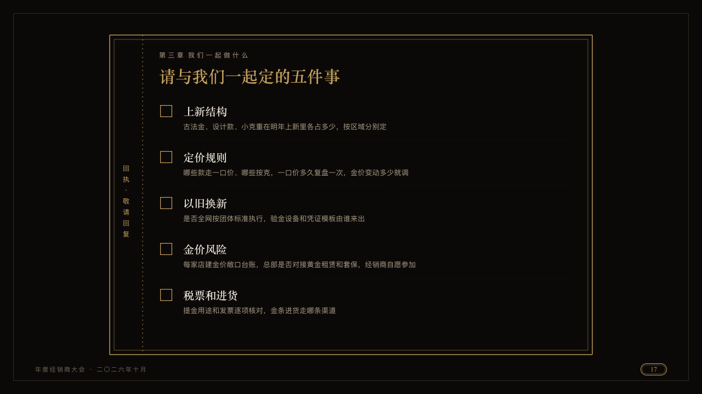

# reply

The things a house asks its guests to settle, set as the reply card an invitation carries.

Code: [`src/layouts/compositions/reply.tsx`](../../../src/layouts/compositions/reply.tsx). The header comment there is the contract. The invitation setting only.

## luxe, gold dealer conference sample, 2026-10

Settled on p17. The round's decisions are in [2026-10-08-luxe](../../rounds/2026-10-08-luxe/README.md).

| board (p17) | engine |
| :-: | :-: |
|  |  |

**What it looks like.** A gilt card in the middle of the page with a stub at its left torn off along a dashed gold line. Down the stub the page's `stamp` in small gold type, upright in Chinese and turned in any other script. On the card the chapter, the claim in the gold serif set from the left, then each item: an empty gold box to tick, its name in the ivory serif and a line in old gold, a dotted hairline between items.

**Why.** An invitation ends with a card to send back. Asking dealers to settle five things together is that card.

**What it gave up.**

- Takes one `row_cards` of three to five items on a page with a `stamp`. Only this composition takes a page with one.
- A stamp that does not fit the stub, or a name or line past its room, sends the page back, and the face declares the stamp dropped.
