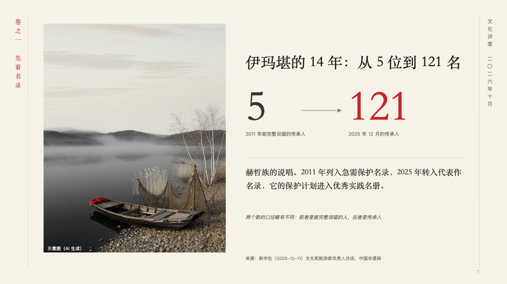
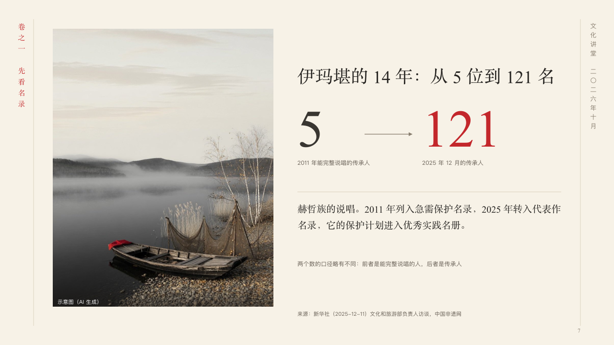

# revival

A figure then and a figure now, beside a photograph.

Code: [`src/layouts/compositions/revival.tsx`](../../../src/layouts/compositions/revival.tsx). The header comment there is the contract. The scroll setting only.

## ink, intangible heritage public lecture sample, 2026-10

Settled on p07. The round's decisions are in [2026-10-07-ink](../../rounds/2026-10-07-ink/README.md).

| board (p07) | engine |
| :-: | :-: |
|  |  |

**What it looks like.** A photograph 460px wide runs the height of the page at the left, its note in white at its foot. Beside it the claim at 38px, then two figures at 110px in the heading face with an arrow between them: the earlier in the second ink, the later one the author marks (`**…**`) in cinnabar, each with what it counts under it in the grey. Under a hairline the story in the heading face, and under it a caution in the grey (a plain `callout`), never slanted. The source stands under the column.

**Why.** A revival is two numbers and the years between them. The photograph sets where it happens and the arrow says which way it went.

**What it gave up.**

- Takes an `image`, a `kpi_cards` of two, a `paragraph`, then optionally a `callout` with words alone.
- A card with a note, a tag, a delta, a tone, a source or a symbol, a callout with a title, a symbol or a tag, a figure, label, story or caution past its room, or a claim that does not fit beside the photograph sends the page back.
