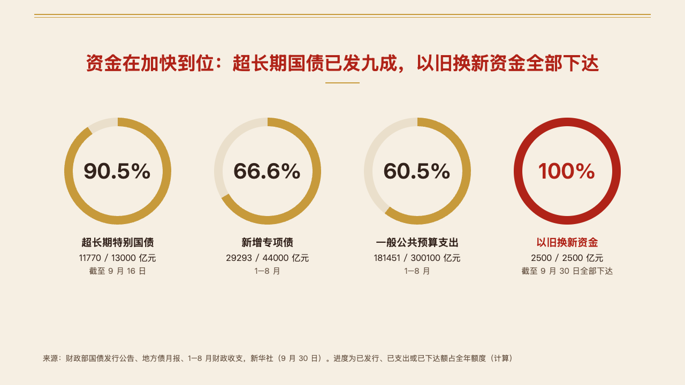
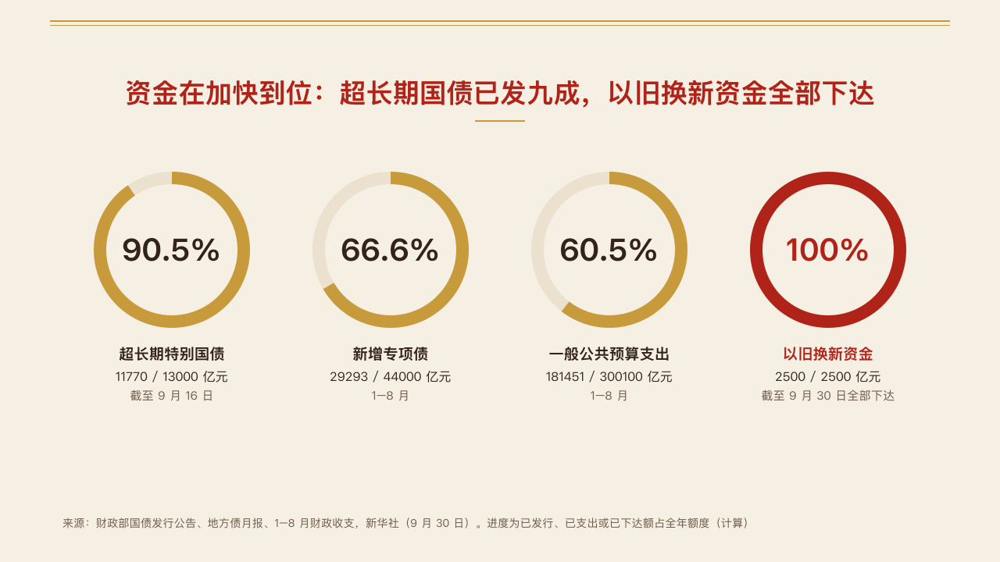

# rings

Completion rates as large rings in a row, each with the amounts behind it.

Code: [`src/layouts/compositions/rings.tsx`](../../../src/layouts/compositions/rings.tsx). The header comment there is the contract. The seal setting only.

## vermilion, government work report sample, 2026-10

The round's decisions are in [rounds/2026-10-04-vermilion](../../rounds/2026-10-04-vermilion/README.md).

| board (p12) | engine |
| :-: | :-: |
|  |  |

**What it looks like.** One `progress_donuts` of up to five items without icons. Rings 92px across their middle on a 16px stroke: a pale track and the progress in the accent, the rate bold at 40px inside. Under each ring its name bold at 19px, its `detail` (the amounts) at 16px and its `source` at 15px. The rate the author marks takes the mark for its progress, its rate and its name.

**Why.** How much of a year's money has gone out is a share of a whole, and the amounts behind it are what make the share mean something.

**What it gave up.**

- A name, detail or source past one line of its column, or a rate wider than its ring, declines.
