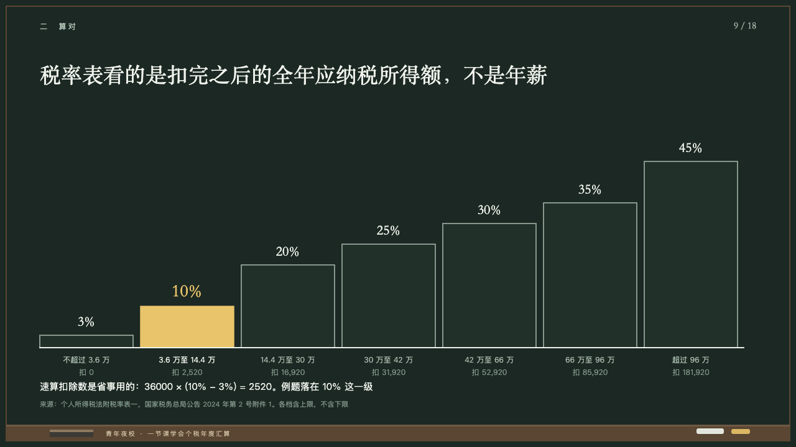
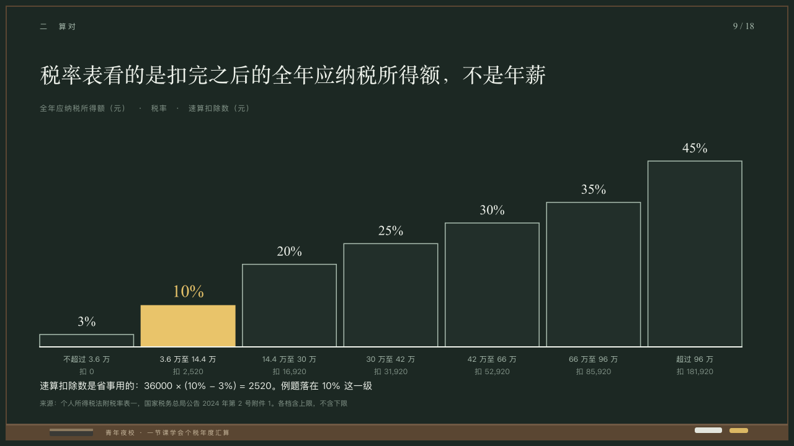

# risers

A rate table as a staircase.

Code: [`src/layouts/compositions/risers.tsx`](../../../src/layouts/compositions/risers.tsx). The header comment there is the contract. The chalkboard setting only.

## lecture, annual tax reconciliation evening class sample, 2026-10

Settled on p09. The round's decisions are in [2026-10-08-lecture](../../rounds/2026-10-08-lecture/README.md).

| board (p09) | engine |
| :-: | :-: |
|  |  |

**What it looks like.** One step a row from x64 to x1196, as tall as its rate over the highest (300px for the highest), standing on a chalk line on y560, each a box of the board with a grey edge and its rate over it at 22px in the serif. The highlighted row is filled in yellow with its rate at 28px in yellow. Under the line the range at 12px and the third column at 12px in the dim. The columns' names small and tracked at the top left. A worked line at 15/26 on y610.

**Why.** Rates climb in steps, and the step the example lands on is the one filled in.

**What it gave up.**

- Takes a `data_table` of three to eight rows and two or three columns, one of them every cell a percentage, at most one row highlighted, and optionally a `paragraph`.
- The column names stand small at the top left, which the board left off, so every word of the table is on the page.
