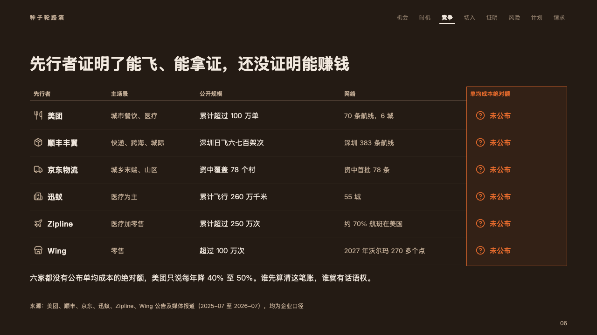
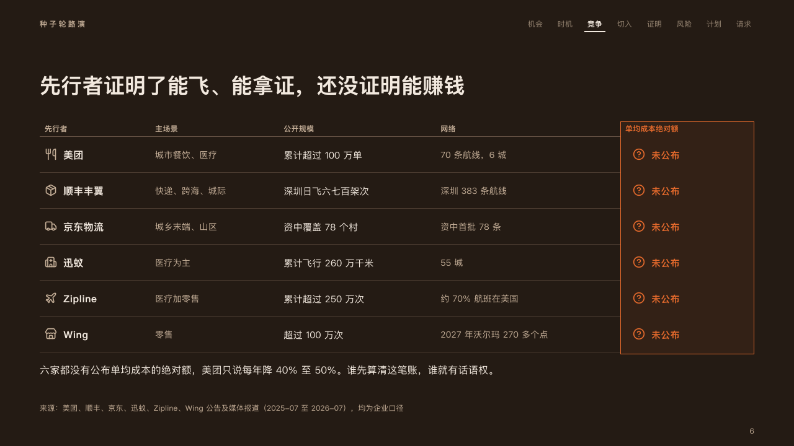

# rivals

Who is already in the market and what none of them has said: an open table whose last column stands in a frame of the fire.

Code: [`src/layouts/compositions/rivals.tsx`](../../../src/layouts/compositions/rivals.tsx). The header comment there is the contract. The pitch setting only.

## ember, low-altitude delivery pitch sample, 2026-10

Settled on the pioneers page (p06). The round's decisions are in [rounds/2026-10-06-ember](../../rounds/2026-10-06-ember/README.md).

| board (p06) | engine |
| :-: | :-: |
|  |  |

**What it looks like.** The columns' names at 12px bold in the warm grey over a hairline. One row a rival, 58px tall: its icon and its name bold at 16px, then what it does in the warm grey, how big it is in the ivory, where it runs in the warm grey, a dark rule between rows. The last column, the one the page is about (`columns[].emphasis`), stands in a 1px frame of the fire over the fire at 8% on the stage, its name, its icon before every cell (`columns[].icon`, a question mark in a ring) and its cells bold in the fire (「未公布」, "Not published"). Under the table the page's point at 16/26, up to two lines.

**Why.** A pitch's landscape page is read for the gap. Every rival's facts are plain, and the one figure none of them has published is the only thing lit.

**What it gave up.**

- A `data_table` of three to six columns, the last marked and no other, two to six rows with no tag or emphasis, no title or source, then optionally a `callout` with no title, tag or icon.
- A cell is one line: a cell wider than its column sends the page back rather than wrapping. So does a column name past one line or a closing line past two.
- The frame starts at the top of the body, y196, where the board started it at y186.
