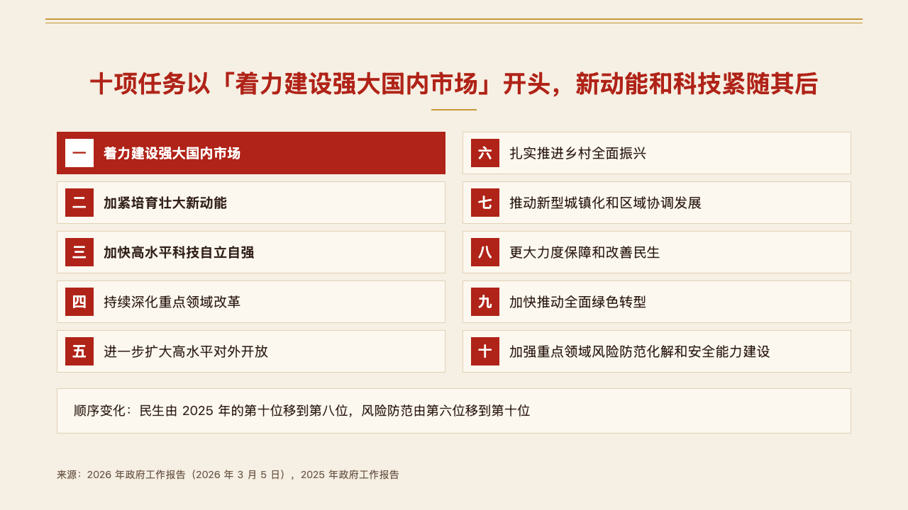
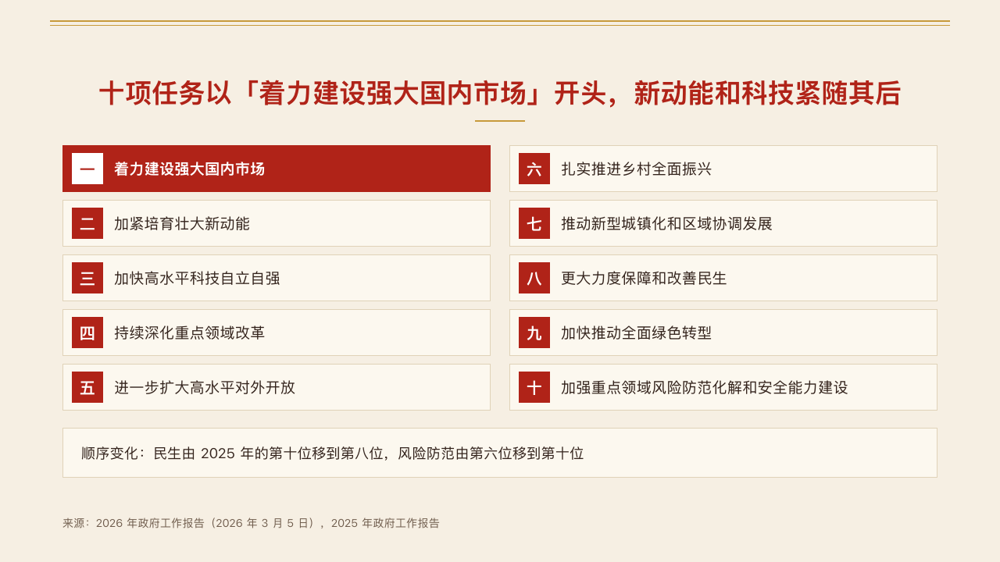

# roster

A list of six to ten short items in two columns of numbered cells, the way a report lists its tasks.

Code: [`src/layouts/compositions/roster.tsx`](../../../src/layouts/compositions/roster.tsx). The header comment there is the contract. The seal setting only.

## vermilion, government work report sample, 2026-10

The round's decisions are in [rounds/2026-10-04-vermilion](../../rounds/2026-10-04-vermilion/README.md).

| board (p06) | engine |
| :-: | :-: |
|  |  |

**What it looks like.** One `numbered_cards` of six to ten items with titles only, optionally followed by a `callout`. Cells 60px tall, 70px apart, the first half down the left column and the rest down the right: the panel with a hairline edge, a 40px numbered square and the title at 19px. The item the author marks is reversed out of the mark, its title bold and its square white. The callout closes the page as a note panel.

**Why.** A work report's ten tasks are a list read in order. Two columns keep all ten on one page at a size the room can read.

**What it gave up.**

- Titles only: an item with `text` or `sub` goes to the numbered rows or the ordinary cards. A title past one line of its cell declines.
- One mark: the board also set the second and third titles bold. See the round's decisions.
