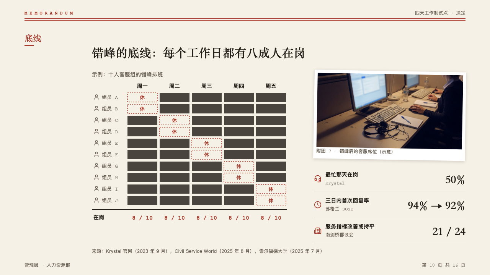
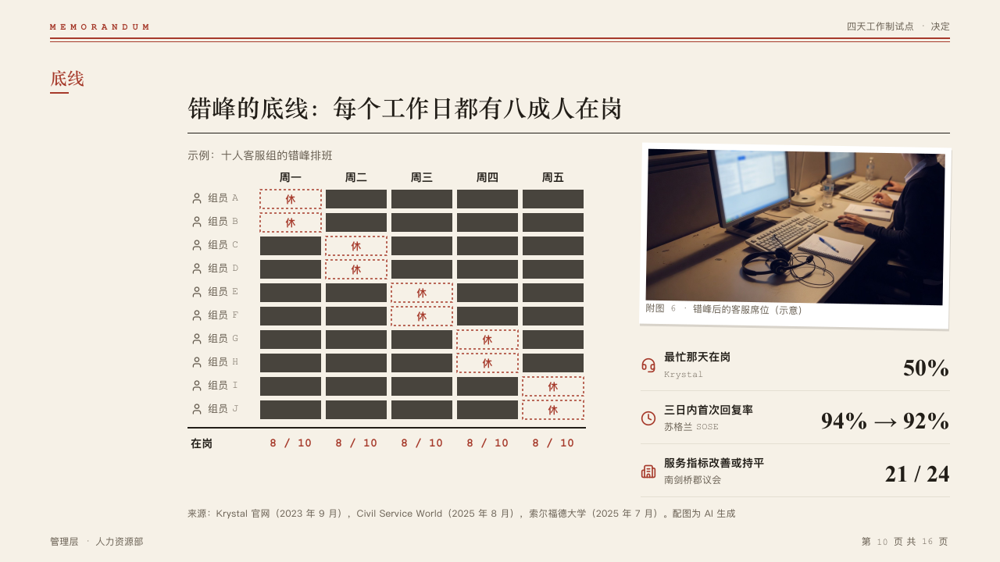

# rota

Who is on and who is off, day by day, as a grid of blocks, with how many are in each day.

Code: [`src/layouts/compositions/rota.tsx`](../../../src/layouts/compositions/rota.tsx).

## memo, four-day week decision sample, 2026-10

Settled on the coverage page (p10), beside an `annex` column of evidence rows. The round's decisions are in [rounds/2026-10-05-memo](../../rounds/2026-10-05-memo/README.md).

| board (p10) | engine |
| :-: | :-: |
|  |  |

**What it looks like.** The table's title at 14px muted over the grid. Names at 13px after their icons, each day a column 84px wide under its name, rows 30px apart. A day the person is in is a block of ink, a day off holds the table's one word for it (「休」, "Off") in the mark inside a dashed outline of the mark. A closing total row is typed under a 2px rule of ink in bold mono in the mark.

**Why.** A rota is read across a week and down a team at once, and the blocks make the gaps visible before anyone reads a word.

**What it gave up.**

- A `data_table` of a names column and three to seven day columns whose cells are blank or one short word, the same word everywhere, then optionally a total row.
