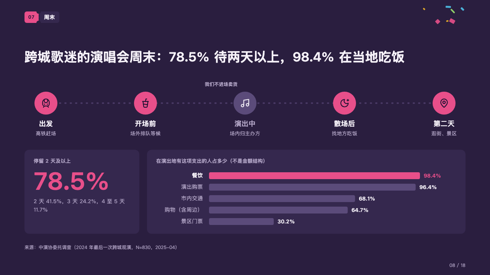
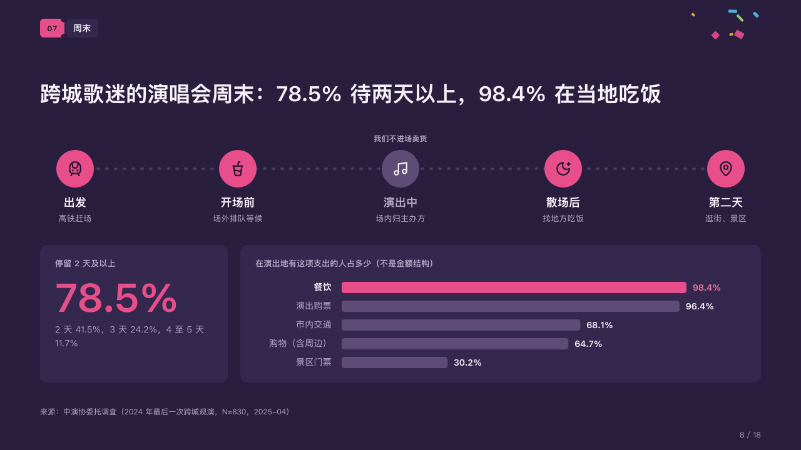

# route

A weekend walked stop by stop, with the figures it ends on.

Code: [`src/layouts/compositions/route.tsx`](../../../src/layouts/compositions/route.tsx). The header comment there is the contract. The marquee setting only.

## rally, summer concert season proposal sample, 2026-10

Settled on the weekend page (p08). The round's decisions are in [rounds/2026-10-06-rally](../../rounds/2026-10-06-rally/README.md).

| board (p08) | engine |
| :-: | :-: |
|  |  |

**What it looks like.** Along a dotted line, a disc 60px across a stop with its icon, its name under it and a grey line under that. The discs are the magenta; a stop the plan stays out of (`tone: "warning"`) is the dim violet with a light icon and a grey name, and the sentence after its first (「我们不进场卖货」) stands over its disc. Under the route two cards: at the left a figure in the magenta with its label over it and its note under; at the right bars on their side with the chart's caption over them, the marked bar in the magenta and the rest in the dim violet.

**Why.** The proposal's point is when fans have time and money outside the venue. Walking the weekend shows that the stop inside the venue is the one the brand leaves alone.

**What it gave up.**

- A `steps` of two to five with icons, at most one with a tone and that one `warning`; then a `kpi_cards` of one item; then a `bar` chart on its side of one series of two to six bars, at most one marked, with no notes or ranges.
- A name or a line wider than its stop, a second sentence on a stop that is not set aside, the figure wider than its card, a note past three lines, a bar's name past its column or the caption past one line sends the page back.
