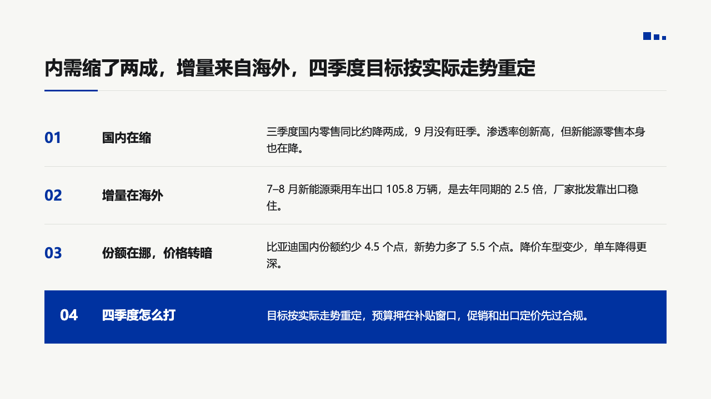
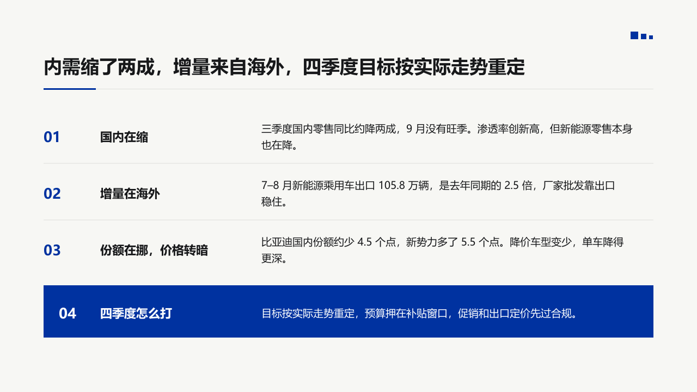
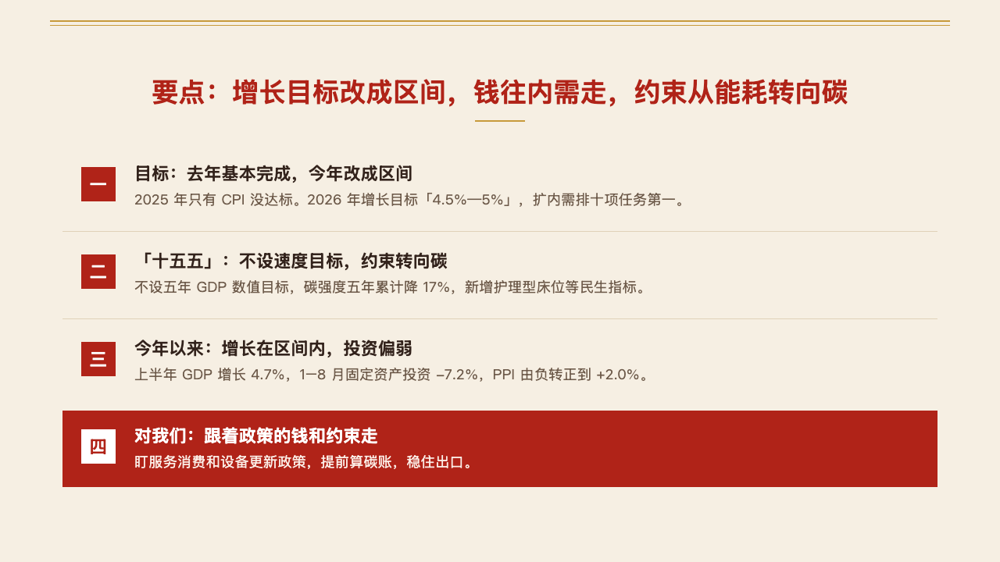
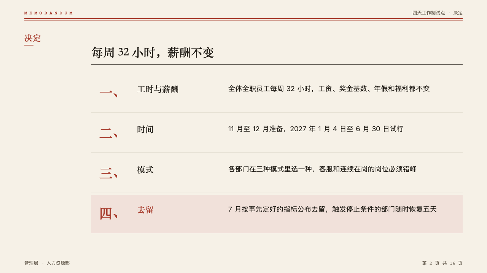
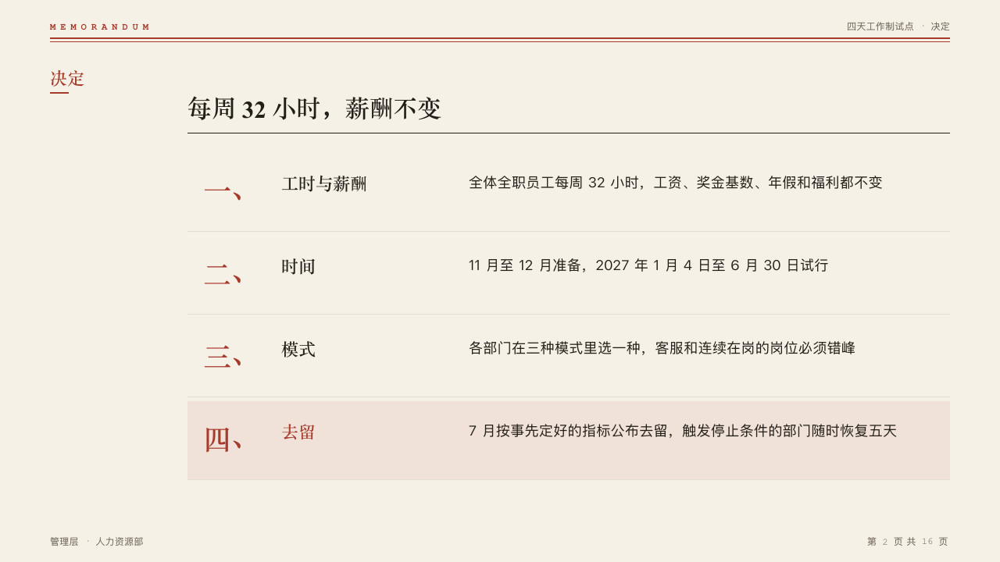
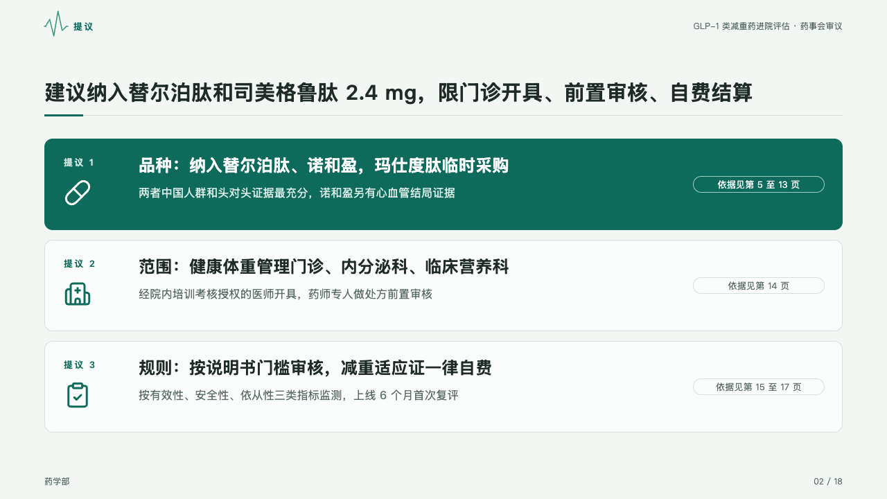

# rows

A short list set as ruled, numbered rows, each a bold label and its gloss, with an optional closing line reversed out of a primary block.

Code: [`src/layouts/compositions/rows.tsx`](../../../src/layouts/compositions/rows.tsx). The header comment there is the contract: what it takes, when it declines, the band it needs, the tokens it reads.

## brief, 2026-10

| board (p05) | engine |
| :-: | :-: |
|  |  |

**What it looks like.** A muted "01" at 18px, the label in bold primary at 26px in a 360px column, the gloss in body ink at 26px from x520, and a hairline under each row, 88px apart when every row is one line. The closing line sits in a full-width primary block in white at 28/40, the only solid shape on the page.

**Why.** The page says "each cause is this", and a label beside its gloss reads as a table without drawing one. Numbers give the order without bullets. The closing block says the "so what" once, and its weight is what makes the rows above it read as evidence.

**What it gave up.**

- Only "Label: gloss" items split into two columns (a full-width colon, or an ASCII colon followed by a space, so "10:30" stays whole). Any other item runs across both columns.
- Text is set at the board's sizes or not at all. Two to five items, every label and gloss within two lines, the closing line within three. Anything else goes back to the face, which draws an ordinary bullet list.
- A warning callout or one with an icon is declined: the block has no place for an icon, and a warning is not a conclusion.
- A marked run in the closing block turns bold instead of taking the theme's highlight, which would sit on primary with no contrast.
- The label column was sized for English labels. Short Chinese labels leave it airy, as the engine render shows.

## Since the tea sample, 2026-10

The closing block moved to [`src/layouts/compositions/closing.tsx`](../../../src/layouts/compositions/closing.tsx), shared with `table`, `track` and `figures`, each at the size its board gives it. Rows draws it byte for byte as before.

## bulletin, NEV sample, 2026-10

The notice setting (`setting: "notice"`), which bulletin's `notice-sheet` passes. The round's decisions are in [rounds/2026-10-03-bulletin](../../rounds/2026-10-03-bulletin/README.md).

| board (p02) | engine |
| :-: | :-: |
|  |  |

**What it looks like.** Each row is a 104px band with a hairline between rows: the number bold in primary at 26px, the label black and bold at 22px in a 280px column from 104px in, and the gloss at 19/30 from 400px in. It takes `numbered_cards` as well as bullets. The card the author marks (`items[].emphasis`) is reversed out of a primary block 8px clear of the row above, and is the page's answer. A closing callout becomes the light grey panel, not a primary block.

**Why.** IKB is spent once a page, so the answer row takes it and nothing else does. The number in primary carries the brand on the other rows without competing with the answer.

**What it gave up.**

- A card with a `sub` line is declined.
- Three to five cards, or two to five bullets. Rows shrink to 84px before the composition declines.

## vermilion, government work report sample, 2026-10

The seal setting's form, in [`rows-seal.tsx`](../../../src/layouts/compositions/rows-seal.tsx). The round's decisions are in [rounds/2026-10-04-vermilion](../../rounds/2026-10-04-vermilion/README.md).

| board (p02) | engine |
| :-: | :-: |
|  |  |

**What it looks like.** One `numbered_cards` of two to five items with no `sub`, or a `bullets` of two to five written "label：gloss", optionally followed by a `callout`. Rows 112px apart on hairlines (taller when a title or gloss takes its second line): a 44px square in the mark with the item's number in the deck's numerals (一、二、三, or 1, 2, 3 in an English deck), the title bold at 22/32 and the gloss at 18/28 in the quiet ink. The item the author marks is reversed out of the mark, its square white and its words white. The callout closes the page as a note panel.

**Why.** A summary of four points is read in order, and the one the briefing lands on is the one for the room.

**What it gave up.**

- The old points page's large 「04」 in a circle: the number now sits in each row's square.

## memo, four-day week decision sample, 2026-10

The memo setting's form, in [`rows-memo.tsx`](../../../src/layouts/compositions/rows-memo.tsx). Settled on the decision page (p02) and, in its narrow form, on the process page (p12, board in [compositions/annex](../annex/memo-p12.board.png)). The round's decisions are in [rounds/2026-10-05-memo](../../rounds/2026-10-05-memo/README.md).

| board (p02) | engine |
| :-: | :-: |
|  |  |

**What it looks like.** Across the body, each clause is 100px tall on a hairline: its numeral at 36px bold in the heading face in the mark (「一、」 in a Chinese deck), its title at 22px in the heading face, its text at 18px in a third column from x360. The marked clause (`emphasis`) sits on the mark's tint with its title in the mark. In a band narrower than 900px, beside an exhibit, the numeral is bare at 30px, the title at 20px and the text under it at 15px in the muted ink, 92px a clause.

**Why.** A decision is quoted by its clause number, so the numbers are the largest thing in each row.

**What it gave up.**

- Three to five `numbered_cards` with no `sub`, or two to five bullets written "Label: text".

## clinic, GLP-1 formulary review sample, 2026-10

The dossier setting's form, in [`rows-dossier.tsx`](../../../src/layouts/compositions/rows-dossier.tsx). Settled on the proposal page (p02) and, as a column of duties, on the pharmacist page (p16). The round's decisions are in [rounds/2026-10-05-clinic](../../rounds/2026-10-05-clinic/README.md).

| board (p02) | engine |
| :-: | :-: |
|  |  |

| board (p16) | engine |
| :-: | :-: |
|  |  |

**What it looks like.** Each proposal is a card 132px tall across the body: its number after the page's section (「提议 1」, from `kicker`) small, bold and tracked, its icon at 40px under it, its title bold at 24px and its text muted at 16px, and at the right a capsule with the item's `sub` (「依据见第 5 至 13 页」). The proposal the page lands on (`emphasis`) is the card filled with the mark, its words reversed out of it. Beside a photograph, a `row_cards` with an icon on every item becomes a column of duties: the icon on a disc of the mark's tint, the title bold and the text muted under it, hairlines between the rows.

**Why.** A submission states its proposals first, each with where its evidence is, so the committee can turn to it.

**What it gave up.**

- Two or three `numbered_cards`, or three to five `row_cards` with icons and no sub, tone or highlight.
