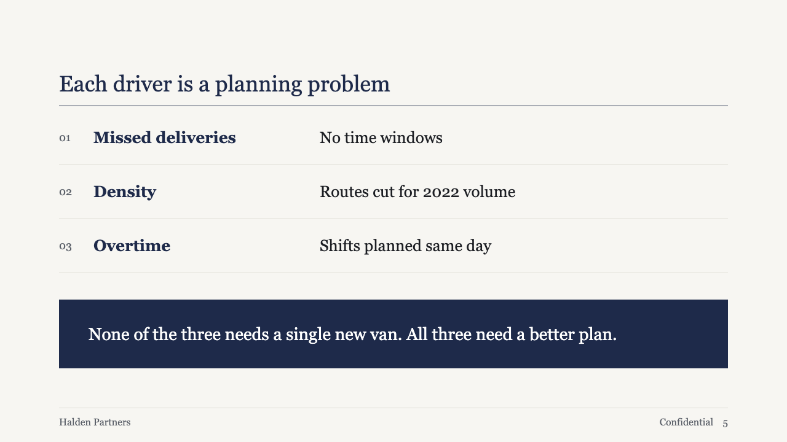
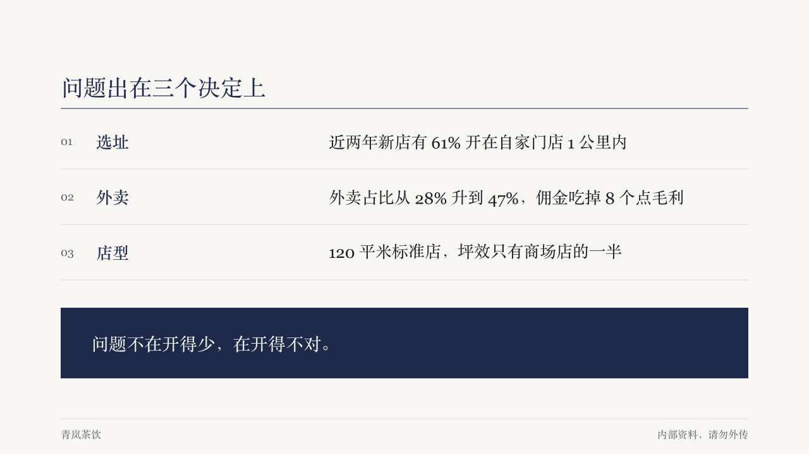

# rows

A short list set as ruled, numbered rows, each a bold label and its gloss, with an optional closing line reversed out of a primary block.

Code: [`src/layouts/compositions/rows.tsx`](../../../src/layouts/compositions/rows.tsx). The header comment there is the contract: what it takes, when it declines, the band it needs, the tokens it reads.

## brief, 2026-10

| board (p05) | engine |
| :-: | :-: |
|  |  |

**What it looks like.** A muted "01" at 18px, the label in bold primary at 26px in a 360px column, the gloss in body ink at 26px from x520, and a hairline under each row, 88px apart when every row is one line. The closing line sits in a full-width primary block in white at 28/40, the only solid shape on the page.

**Why.** The page says "each cause is this", and a label beside its gloss reads as a table without drawing one. Numbers give the order without bullets. The closing block says the "so what" once, and its weight is what makes the rows above it read as evidence.

**What it gave up.**

- Only "Label: gloss" items split into two columns (a full-width colon, or an ASCII colon followed by a space, so "10:30" stays whole). Any other item runs across both columns.
- Text is set at the board's sizes or not at all. Two to five items, every label and gloss within two lines, the closing line within three. Anything else goes back to the face, which draws an ordinary bullet list.
- A warning callout or one with an icon is declined: the block has no place for an icon, and a warning is not a conclusion.
- A marked run in the closing block turns bold instead of taking the theme's highlight, which would sit on primary with no contrast.
- The label column was sized for English labels. Short Chinese labels leave it airy, as the engine render shows.
