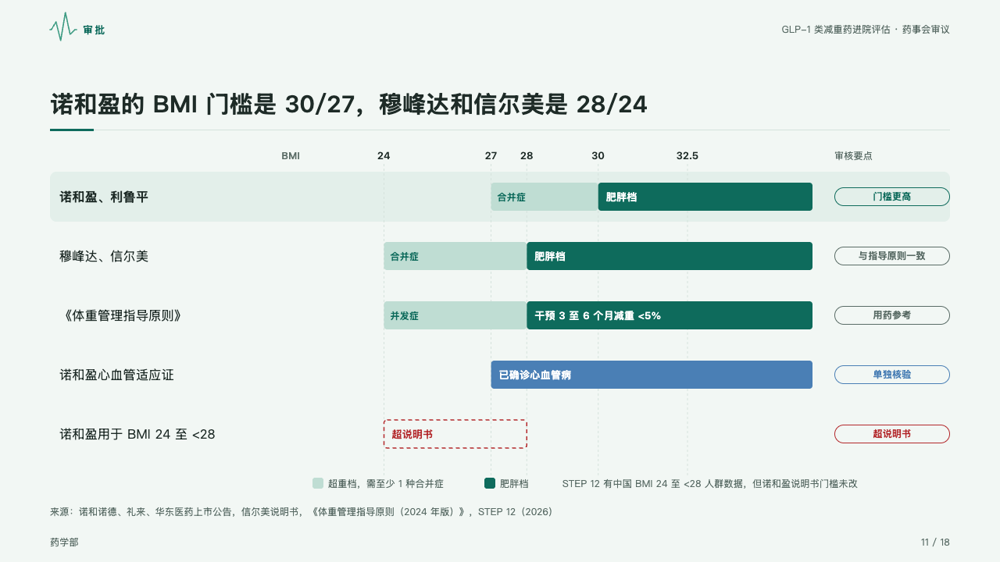
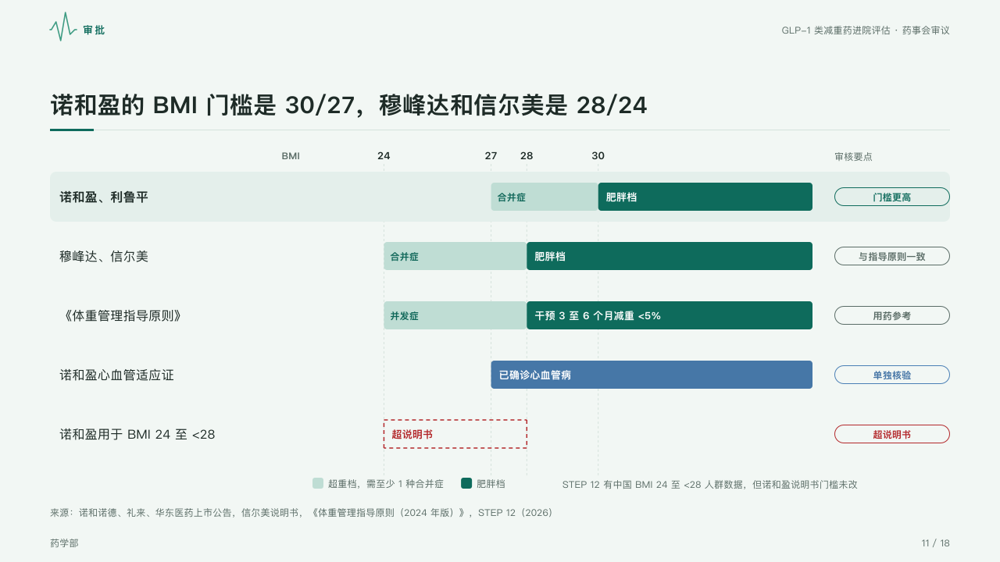

# ruler

Who qualifies where on one scale: each row's bands laid on a ticked axis, its highest band solid, a breach dashed, and what the reviewer does with it at the right.

Code: [`src/layouts/compositions/ruler.tsx`](../../../src/layouts/compositions/ruler.tsx). The header comment there is the contract. The dossier setting only.

## clinic, GLP-1 formulary review sample, 2026-10

Settled on the BMI threshold page (p11). The round's decisions are in [rounds/2026-10-05-clinic](../../rounds/2026-10-05-clinic/README.md).

| board (p11) | engine |
| :-: | :-: |
|  |  |

**What it looks like.** The scale runs from x400 to x1040 across the page, ticked at every threshold the rows name, the comparison's title (「BMI」) at its left. One row 76px a label: its bands laid on the scale, 36px tall, its highest band solid with white words and the bands under it pale, each with its note inside. At the right each row's tag as an outlined capsule. A row is drawn in the mark, on the mark's tint when the page is about it; a row whose tag is a breach (`tone: "danger"`) draws its bands as dashed outlines in the danger ink; a row with any other tag is a case of its own in vein blue. Under the rows a legend names the pale and solid bands by the columns' headers, the page's note beside it.

**Why.** Thresholds read fastest as places on one scale, and an off-label use is a breach, not one more band.

**What it gave up.**

- A `comparison` of one to three columns whose cells are ranges written as a reader would (「27 至 <30」, "≥30", with a band's note after a comma), then optionally a `callout` with no icon.
- A cell that is not a range, overlapping bands, a recommended column, or a label past its room sends the page back.
- The ranges are drawn as the bands' extent on the labelled scale, not printed as words, as on the board.
