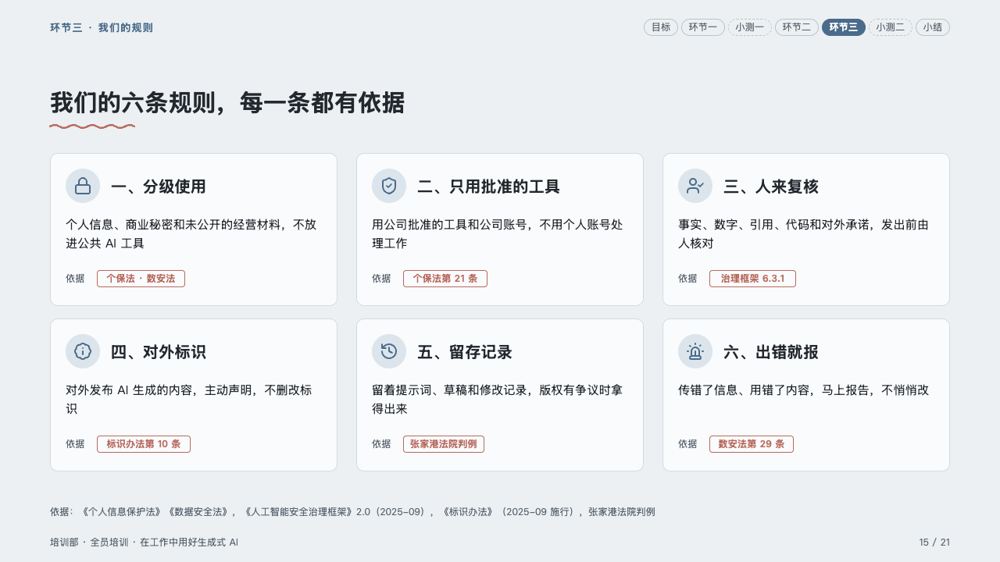
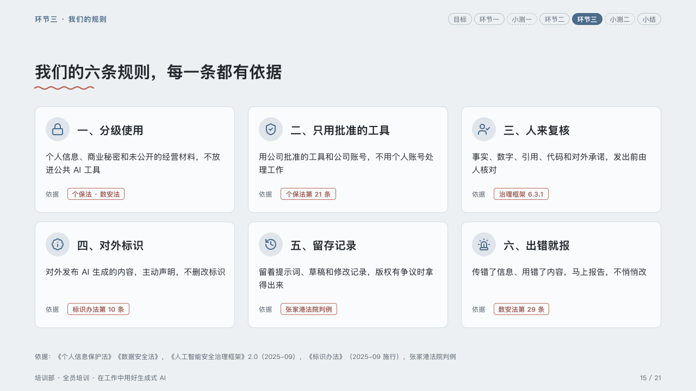

# rules

House rules, each with what it rests on.

Code: [`src/layouts/compositions/rules.tsx`](../../../src/layouts/compositions/rules.tsx). The header comment there is the contract. The lesson setting only.

## homeroom, AI-at-work training sample, 2026-10

Settled on the six rules page (p15). The round's decisions are in [rounds/2026-10-06-homeroom](../../rounds/2026-10-06-homeroom/README.md).

| board (p15) | engine |
| :-: | :-: |
|  |  |

**What it looks like.** A card per rule, three to a row and 196px tall: its icon in the mark on a disc of the mark's tint, its name bold at 20px, the rule at 15/24, and at its foot the provision it rests on as a pill in the pen after the word 「依据」 ("Basis"), the label a tag takes when it cites a law (`basis: "law"`).

**Why.** A rule people are asked to follow should say where it comes from, in the same place on every card.

**What it gave up.**

- An `icon_cards` of three to six rules, each with a tag.
- The word 「依据」/"Basis" is the engine's, printed only before a law.
