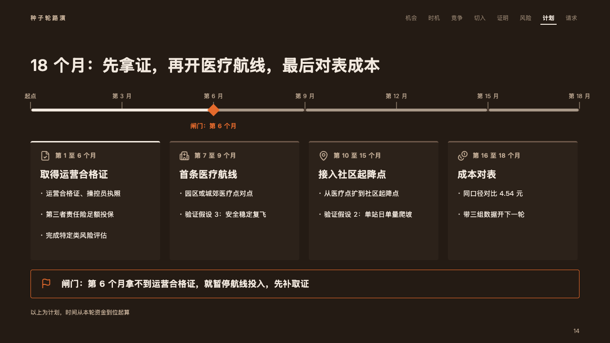
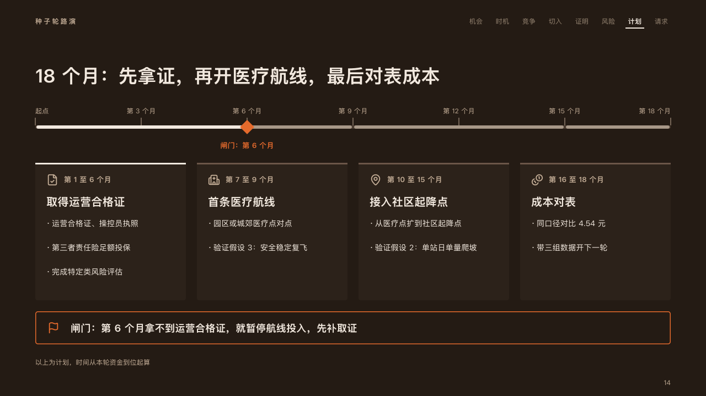

# runway

What a round buys, phase by phase, with the gate that can stop it: the whole run to scale over a card a phase.

Code: [`src/layouts/compositions/runway.tsx`](../../../src/layouts/compositions/runway.tsx). The header comment there is the contract. The pitch setting only.

## ember, low-altitude delivery pitch sample, 2026-10

Settled on the milestones page (p14). The round's decisions are in [rounds/2026-10-06-ember](../../rounds/2026-10-06-ember/README.md).

| board (p14) | engine |
| :-: | :-: |
|  |  |

**What it looks like.** Across the top the whole run to scale, ticked and named every few units from the roadmap's own unit (「起点」, 「第 3 个月」, "Start", "3 months"), each phase a stretch of the bar as long as it lasts, the phase the page is about in the ivory and the others in the palette's quietest ink. Where a phase ends on a check (`checkpoint`) a diamond of the fire stands on the bar with the check named under it. Under the bar a card a phase, 250px tall: a band of the hairline across its top (the ivory on the phase the page is about), its icon and its period at 13px bold in the warm grey, its title bold at 20px and its points as short lines at 14px, each point under the last. Under the cards the gate's rule in a 1.5px outline of the fire with its icon.

**Why.** Investors fund milestones, not months. The run to scale shows how long each costs, and the one gate that can stop the spending is the only thing lit.

**What it gave up.**

- A `roadmap` of two to four phases that all carry a `duration`, with no rows and at most one `checkpoint`, then optionally a `callout` with no title or tag.
- Ticks are named from `duration_unit`, so the board's 「第 3 月」 reads 「第 3 个月」, and the last tick ends at the band's edge.
- Points stack by their own height: a one-line point takes the board's 44px, a point that wraps a line more.
- A tick's name wider than its share of the bar, a period or a title past one line, a point past two lines or points past the card's foot, the check's name wider than the room under it, or the rule past one line sends the page back.
