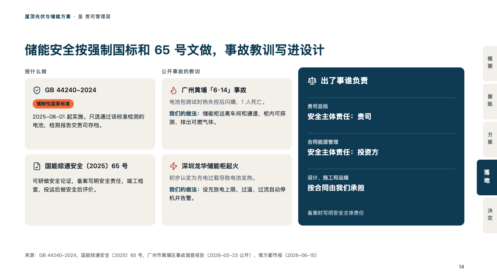
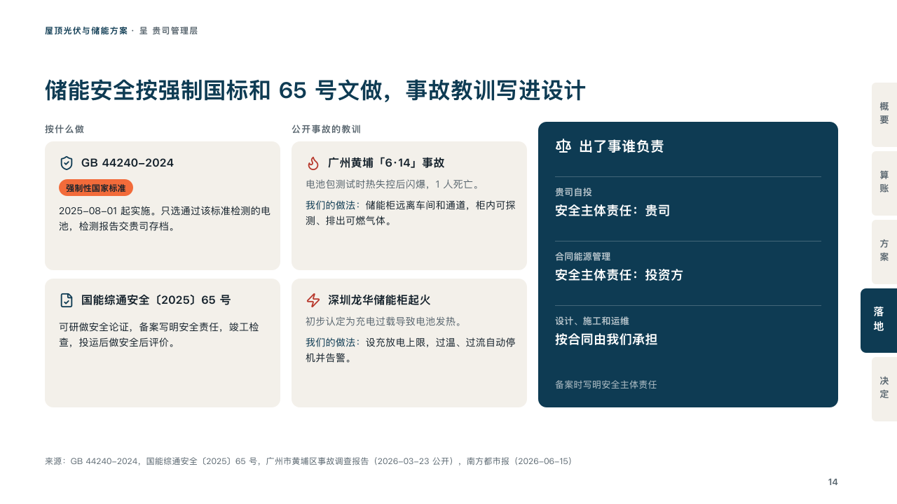

# safeguards

What a risk is held to, what went wrong before and who answers for it.

Code: [`src/layouts/compositions/safeguards.tsx`](../../../src/layouts/compositions/safeguards.tsx). The header comment there is the contract. The binder setting only.

## proposal, rooftop solar and storage proposal sample, 2026-10

Settled on the storage safety page (p14). The round's decisions are in [rounds/2026-10-06-proposal](../../rounds/2026-10-06-proposal/README.md).

| board (p14) | engine |
| :-: | :-: |
|  |  |

**What it looks like.** Three columns. Under its title in small tracked grey, the rules: each card's icon in petrol, its name bold, the tag that settles it as a chip of the tangerine, what it asks. Under its title, the lessons: each card's icon in the danger ink, its name bold, what happened in grey, then what is done about it with its lead in bold petrol (「我们的做法：」). At the right the panel as a block of petrol: its icon and title in white, a row a party under a faint rule (who in a quiet white over what they answer for, bold), its footnote at its foot.

**Why.** Storage safety is where a client's caution starts. The binding rule, the fires that already happened and the name of who is liable, side by side, answer it without reassurance.

**What it gave up.**

- Takes an `icon_cards` of two with a title, tags allowed only when settled, an `icon_cards` of two with a title whose cards are written "what happened。lead：what is done", and an `insight_panel` of two to four rows.
- A title past its column, a card's name past one line or its text past three, a lesson not written that way, or a panel row or footnote past its block sends the page back.
