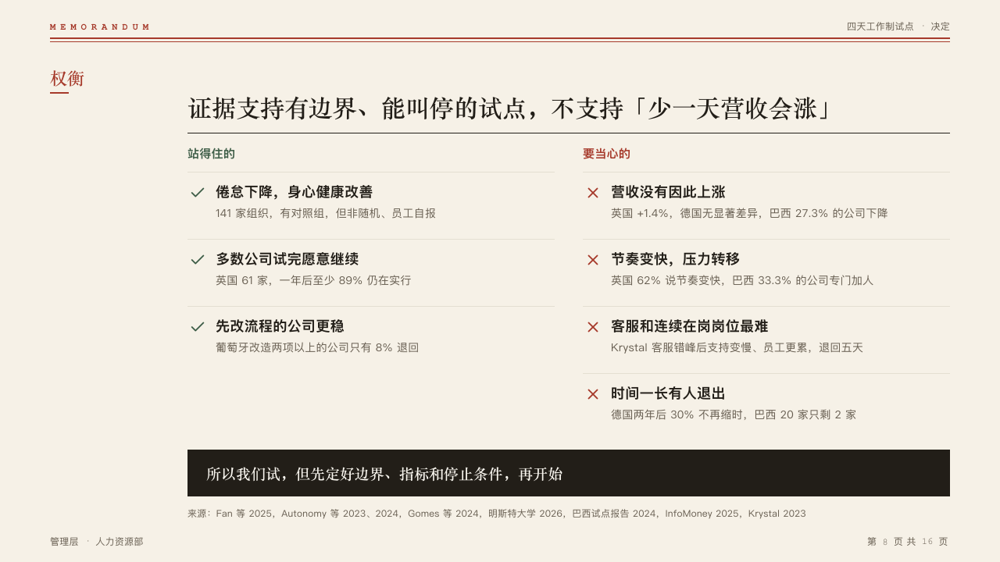

# scales

A proposal weighed in two columns, the verdict in a banner of ink across the foot.

Code: [`src/layouts/compositions/scales.tsx`](../../../src/layouts/compositions/scales.tsx).

## memo, four-day week decision sample, 2026-10

Settled on the weighing page (p08). The round's decisions are in [rounds/2026-10-05-memo](../../rounds/2026-10-05-memo/README.md).

| board (p08) | engine |
| :-: | :-: |
|  |  |

**What it looks like.** The case for under a 15px mono header in the success ink, each point after a check, the case against under one in the mark, each after a cross, 36px between the columns. A point is a bold 18px line with its evidence at 14px in the muted ink under it, 86px apart on hairlines. The verdict closes the page in a 60px banner of ink, bold in the heading face at 19px, lettered in the paper.

**Why.** A weighing is fair when both sides stand side by side and the verdict is set apart from them.

**What it gave up.**

- One `pros_cons`. A point or its evidence past one line, or a verdict past two, sends the page back.
