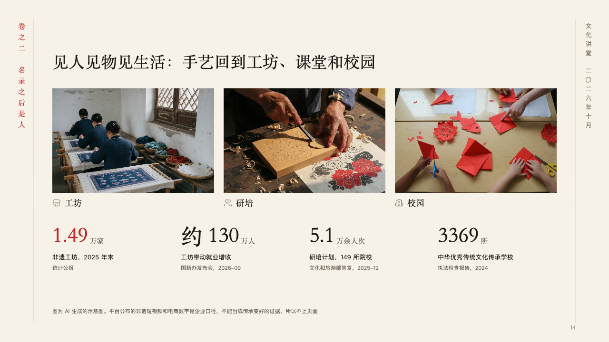
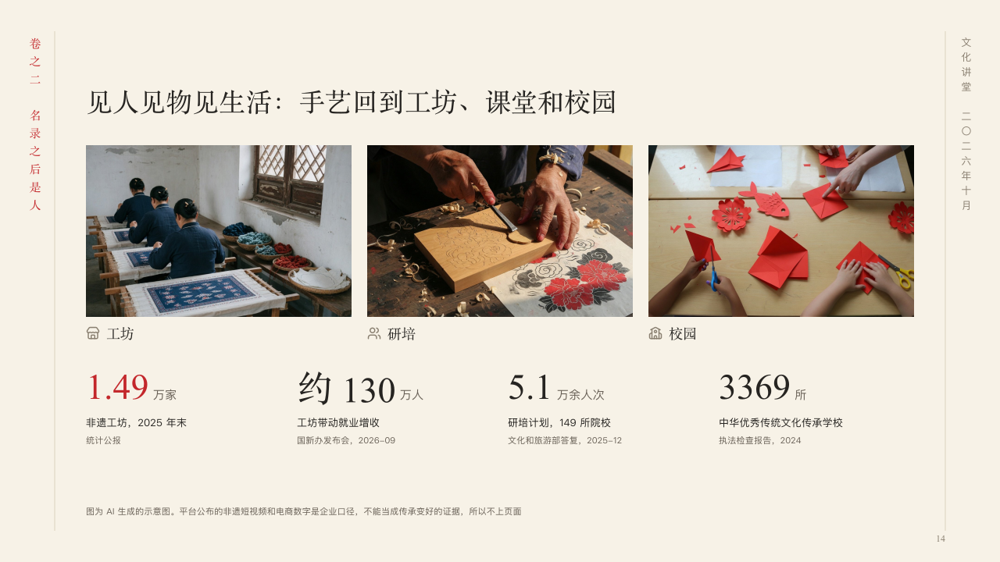

# scenes

Where a thing lives now, in pictures over figures.

Code: [`src/layouts/compositions/scenes.tsx`](../../../src/layouts/compositions/scenes.tsx). The header comment there is the contract. The scroll setting only.

## ink, intangible heritage public lecture sample, 2026-10

Settled on p14. The round's decisions are in [2026-10-07-ink](../../rounds/2026-10-07-ink/README.md).

| board (p14) | engine |
| :-: | :-: |
|  |  |

**What it looks like.** The claim over the page. Under it two to four photographs in a row, each with its symbol and its name in the heading face under it, and under them a row of figures set large in the heading face, the one the author marks (`**…**`) in cinnabar, each with what it counts and, small in the grey, where the figure comes from (its `note`).

**Why.** Heritage back in daily life is a place before it is a figure, so the places come first and each figure keeps its own source under it.

**What it gave up.**

- Takes an `image_grid` of two to four with captions, then a `kpi_cards` of two to four.
- A grid with an emphasis or a tag on a picture, a card with a tag, a delta, a tone, a source or a symbol, or a caption, figure, label or note past its room sends the page back.
