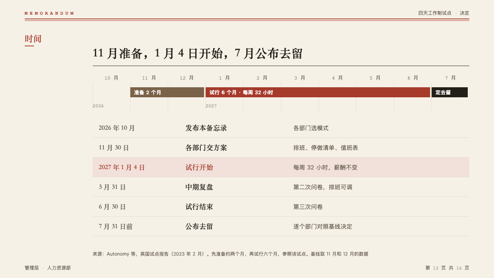
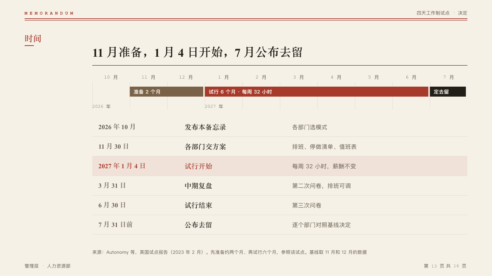

# schedule

A calendar over its dates: the stretches as bars across the months, then the dates as a typed table.

Code: [`src/layouts/compositions/schedule.tsx`](../../../src/layouts/compositions/schedule.tsx).

## memo, four-day week decision sample, 2026-10

Settled on the calendar page (p13). The round's decisions are in [rounds/2026-10-05-memo](../../rounds/2026-10-05-memo/README.md).

| board (p13) | engine |
| :-: | :-: |
|  |  |

**What it looks like.** One column a month, named in 13px mono, hairlines between columns. The stretches are 26px bars with their names lettered in them at 13px: the marked stretch in the mark, those before it in the palette's quiet brown, those after it in ink. A label that carries a year puts the year under the calendar at its column. Under it the dates as a table 50px a row: the date at 17px in the heading face, the title bold at 18px, the note at 15px muted, the highlighted milestone's row on the mark's tint.

**Why.** The calendar shows how long each stretch is, and the table says exactly when.

**What it gave up.**

- A `gantt` whose stretches land on whole units of two to twelve `axis_labels`, then optionally a `timeline` of two to seven milestones on no lanes.
