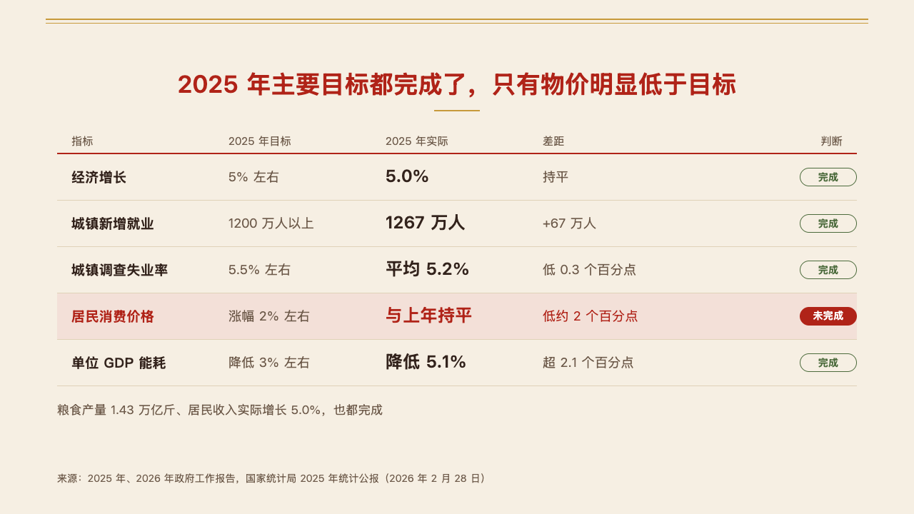
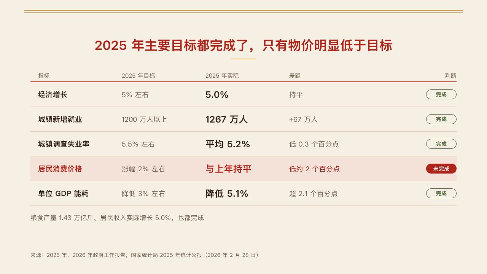

# scores

A scorecard as an open table: each goal, its target, what was reached and the gap, with the verdict as a tag.

Code: [`src/layouts/compositions/scores.tsx`](../../../src/layouts/compositions/scores.tsx). The header comment there is the contract. The seal setting only.

## vermilion, government work report sample, 2026-10

The round's decisions are in [rounds/2026-10-04-vermilion](../../rounds/2026-10-04-vermilion/README.md).

| board (p03) | engine |
| :-: | :-: |
|  |  |

**What it looks like.** One `scorecard` of up to six rows. Headers at 15px over a 2px rule in the mark, the card's own `labels` when it has them. Rows 64px apart on hairlines: the goal bold at 19px, the target at 18px in the quiet ink, what was reached bold at 24px, the gap at 18px, and the verdict at the right edge as a tag: outlined in the success ink when on track, in the accent when to watch, filled in the mark when off track. A goal off track is the page's mark: its row on the mark's pale tint, its goal, figure and gap in the mark. The card's `note` is a line under the table.

**Why.** A year in review is read row by row against its targets, and the one miss is what the room asks about.

**What it gave up.**

- A goal, target, figure or gap past one line of its column declines, and the ordinary scorecard sets the card.
