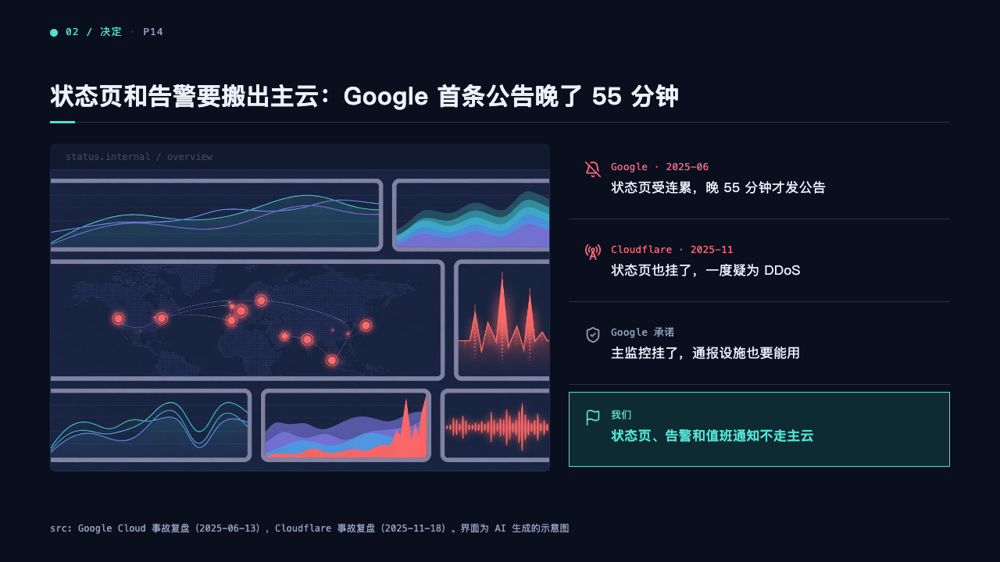
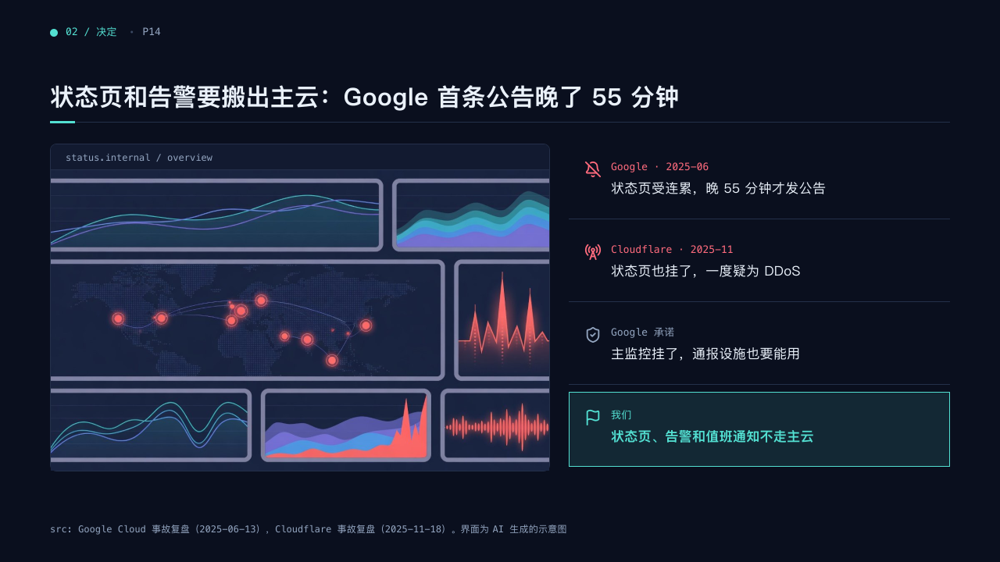

# screen

A browser window beside its log lines.

Code: [`src/layouts/compositions/screen.tsx`](../../../src/layouts/compositions/screen.tsx). The console setting only.

## terminal, cloud outage review sample, 2026-10

| board (p14) | engine |
| :-: | :-: |
|  |  |

The round's decisions are in [rounds/2026-10-05-terminal](../../rounds/2026-10-05-terminal/README.md).

**What it looks like.** A `device_mockup` browser as a well with rounded corners, a 34px bar carrying its `url` in 12px mono, the screenshot filling the rest. Beside it a `row_cards` of three to five lines, each on a hairline: its icon, who or when in 13px mono and what happened at 17px. A line with a `tone` takes its ink for the icon and the name. The highlighted line sits on the mark's tint, bold in the mark.

**Why.** "The status page was down too" is clearest next to a picture of the screen nobody could reach.

**What it gave up.**

- A phone, an address or a line past its room, or a row card with `sub`, sends the page back.
