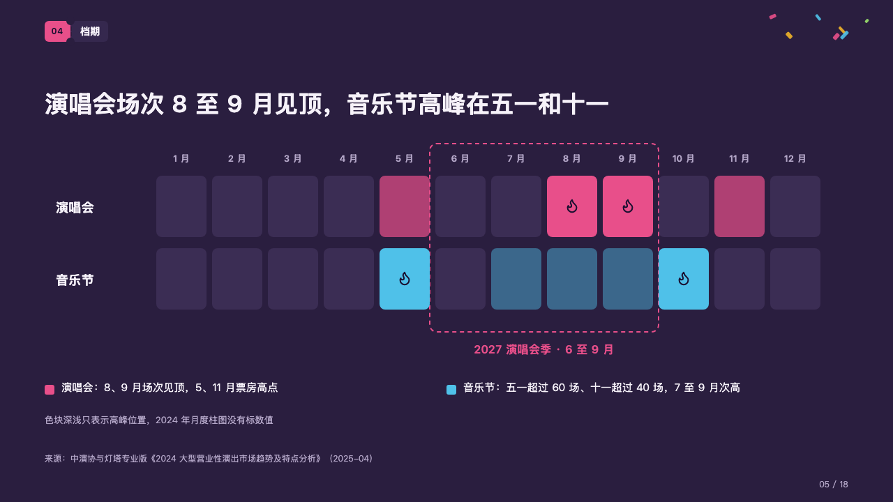
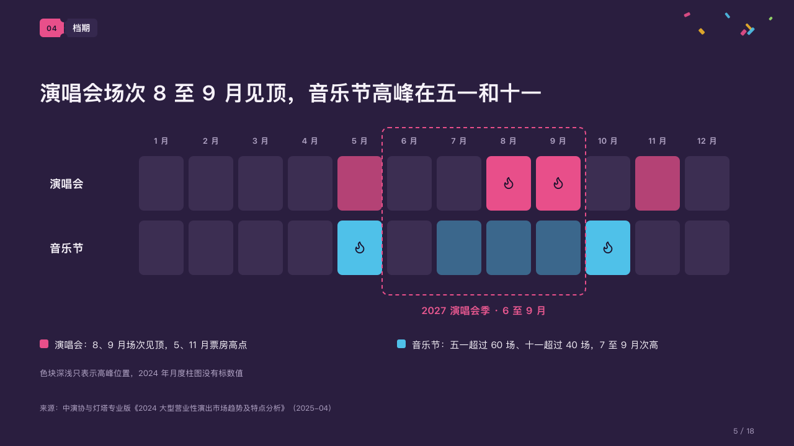

# season

Where in the year things peak, with the season the plan is built around framed.

Code: [`src/layouts/compositions/season.tsx`](../../../src/layouts/compositions/season.tsx). The header comment there is the contract. The marquee setting only.

## rally, summer concert season proposal sample, 2026-10

Settled on the calendar page (p05). The round's decisions are in [rounds/2026-10-06-rally](../../rounds/2026-10-06-rally/README.md).

| board (p05) | engine |
| :-: | :-: |
|  |  |

**What it looks like.** A row of rounded cells 80px apart a month, a row a kind of show: each cell the row's colour at a strength set by its value, the highest cells full with a flame on them, the empty ones a faint violet. The heat grid's band (「2027 演唱会季 · 6 至 9 月」) is framed across both rows by a 2px dashed outline of the magenta, its name under it in the magenta. Under the grid a key, a swatch of each row's colour with the author's line for that row, and a grey note.

**Why.** The season is a decision made against the calendar. Framing June to September over the peaks shows that the plan sits where the concerts peak and the festivals do not.

**What it gave up.**

- The first row takes the magenta, the next the confetti colour furthest from it in hue, so two rows never read as one.
- A `heatmap` of one to three rows and four to twelve columns, no titles or printed values, at most one band; then a `callout` a row whose text starts with the row's name and a colon, in the rows' order; then optionally a note. Callouts with no title, icon or tag.
- A column name wider than its cell, a row name past its column, the band's name past one line, a key line past its half of the measure or a note past one line sends the page back.
