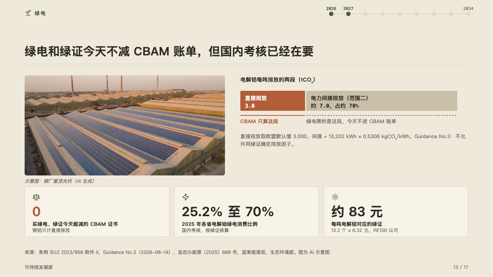
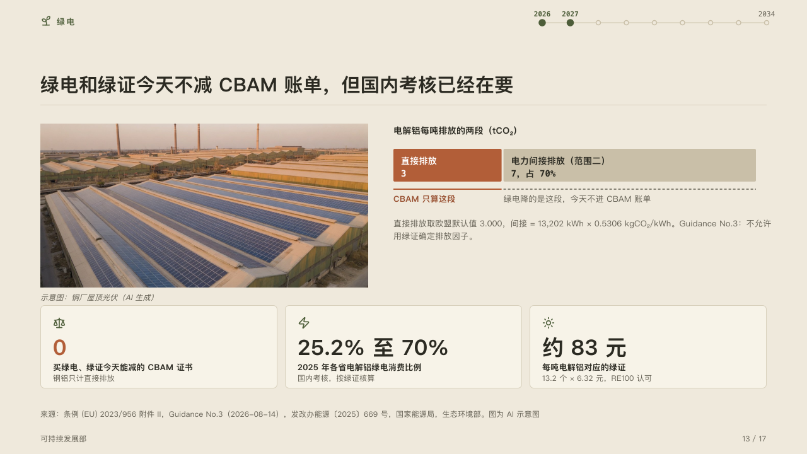

# segments

A whole cut in two or three, and what each part means, beside a photograph.

Code: [`src/layouts/compositions/segments.tsx`](../../../src/layouts/compositions/segments.tsx). The header comment there is the contract. The yearbook setting only.

## almanac, CBAM sample, 2026-10

Settled on the green power page (p13). The round's decisions are in [rounds/2026-10-05-almanac](../../rounds/2026-10-05-almanac/README.md).

| board (p13) | engine |
| :-: | :-: |
|  |  |

**What it looks like.** The photograph on the left with its caption in italics. On the right the whole's name and unit in bold over one bar cut into its parts: the part the page marks in the accent, the others in the ghost, each its name and its amount in mono inside it, an unmarked part's share after its amount. Under each part a line along it and what it means: under the marked part a solid line in the accent and the chart's own line for it (`emphasis_label`), under another a dashed line in the muted ink and its note (`data[].note`). Under the bar a muted note. Across the foot a row of figure cards.

**Why.** Green power lowers the part of the emissions the charge does not count today. The page has to say what each part means, under the part, or the reader assumes the opposite.

**What it gave up.**

- An `image`, a share bar (a `stacked` chart on its side with one category) of two or three parts, one of them marked and without a note, then optionally one `callout` with no icon, title or tag, then a `kpi_cards` of two to four items.
- A part too narrow for its words, a meaning wider than its part's column, a note past its lines, or anything taller than the band sends the page back.
- A value prints as written in the page's JSON, where 3.0 is 3. The board wrote 3.0 and 7.0.
