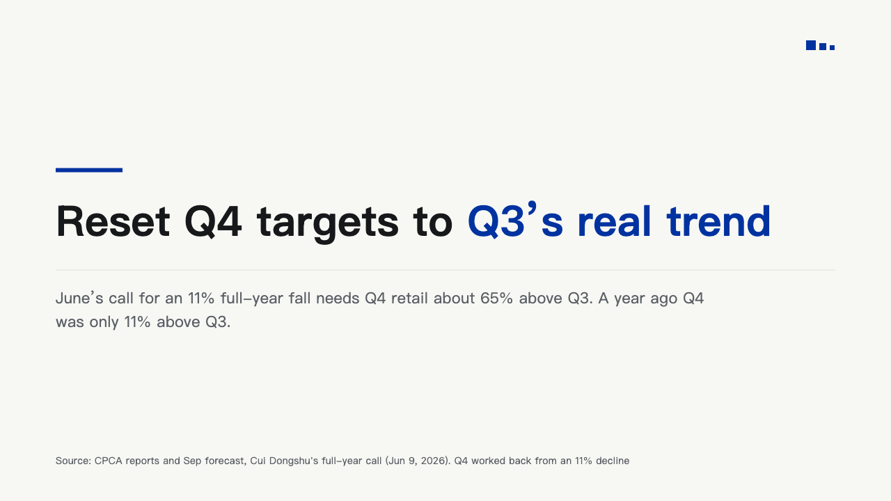
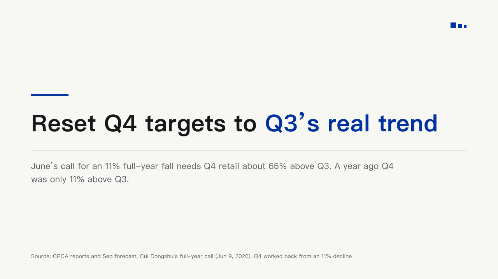

# sentence

One sentence as the page: no claim header, the claim itself set large over a short bar of the brand colour, the line that backs it under a hairline.

Code: [`src/layouts/compositions/sentence.tsx`](../../../src/layouts/compositions/sentence.tsx). The header comment there is the contract. The notice setting only.

## bulletin, kinds round, 2026-10

Settled on the statement pages p01, p02 and p07. The round's decisions are in [rounds/2026-10-09-bulletin-kinds](../../rounds/2026-10-09-bulletin-kinds/README.md).

| board | engine |
| :-: | :-: |
|  |  |
|  |  |
|  |  |

**What it looks like.** A 96 by 6 IKB bar, 30px under it the claim bold at 60/80 in a 1080px measure, its marked words in IKB, 30px under the last line a 1px hairline from x80 to x1200, and 22px under the hairline the page's one paragraph at 22/34 muted in a 960px measure. The whole block is centred between y110 and y610. Words are kept whole: a line breaks at a space or after a clause mark (「，」「。」「：」), never inside a word or a figure and never after the enumeration comma 「、」.

**Why.** A statement page exists to say one thing. Under the ordinary header the sentence was 34px and the page under it empty, so the sentence takes the header's place and grows.

**What it gave up.**

- A claim and one `paragraph` (or the page's subheading when there is no paragraph). Anything else, or a claim past three lines at 60px, goes to the notice sheet.
- The board tracks the sentence half a pixel tighter. The export carries no letter spacing, so the engine sets it untracked and an English line runs about 14px longer.
