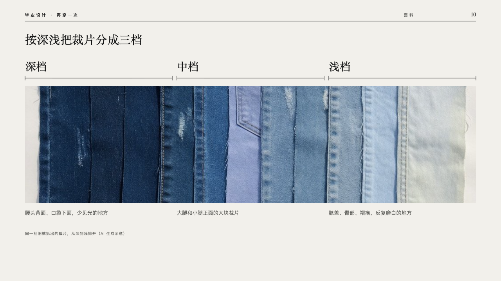
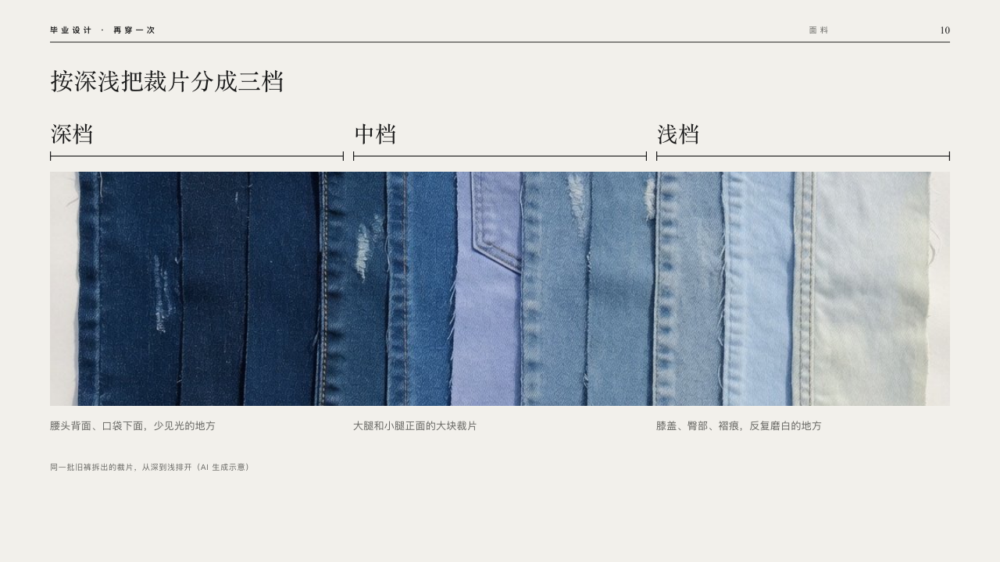

# shades

One picture across the page, bracketed into its grades.

Code: [`src/layouts/compositions/shades.tsx`](../../../src/layouts/compositions/shades.tsx). The header comment there is the contract. The lineup setting only.

## runway, graduation collection review sample, 2026-10

Settled on p10. The round's decisions are in [2026-10-08-runway](../../rounds/2026-10-08-runway/README.md).

| board (p10) | engine |
| :-: | :-: |
|  |  |

**What it looks like.** The claim at 30px over the page. A row of brackets on y200, one a grade, each with its name at 28px in the serif over it. The picture runs the width of the page under them (1152 by 300), and under it what goes into each grade at 13/22 in the stone grey under its bracket. The picture's caption small and grey under that.

**Why.** Grading by shade is the method: the brackets name the grades on the picture of the pieces themselves.

**What it gave up.**

- Takes an `image` and a `row_cards` of two to four items with a title and words and no icon, `sub`, highlight or tone, in either order. The picture's `crop` is kept.
- A name wider than its bracket, words past two lines or a caption past one line sends the page back.
