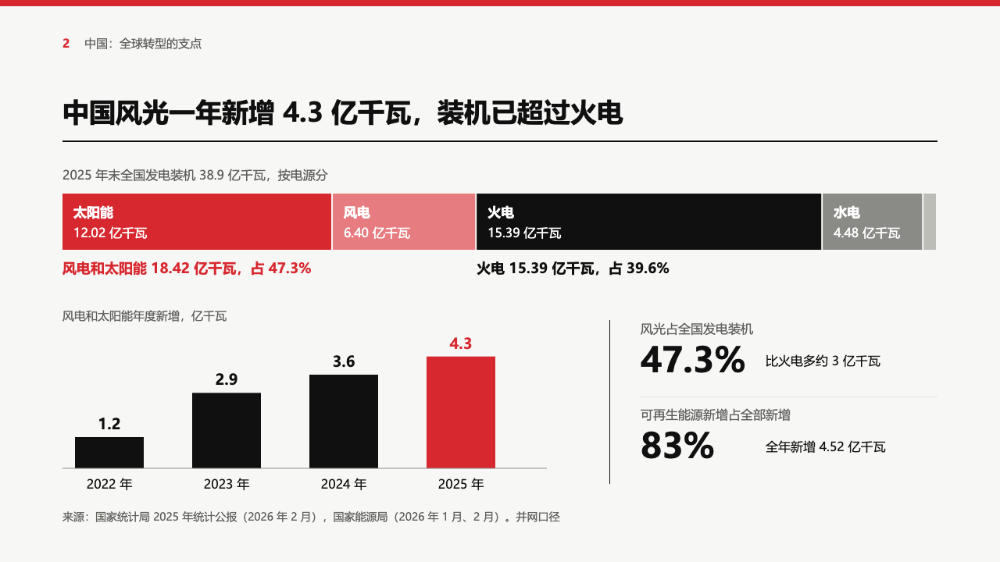
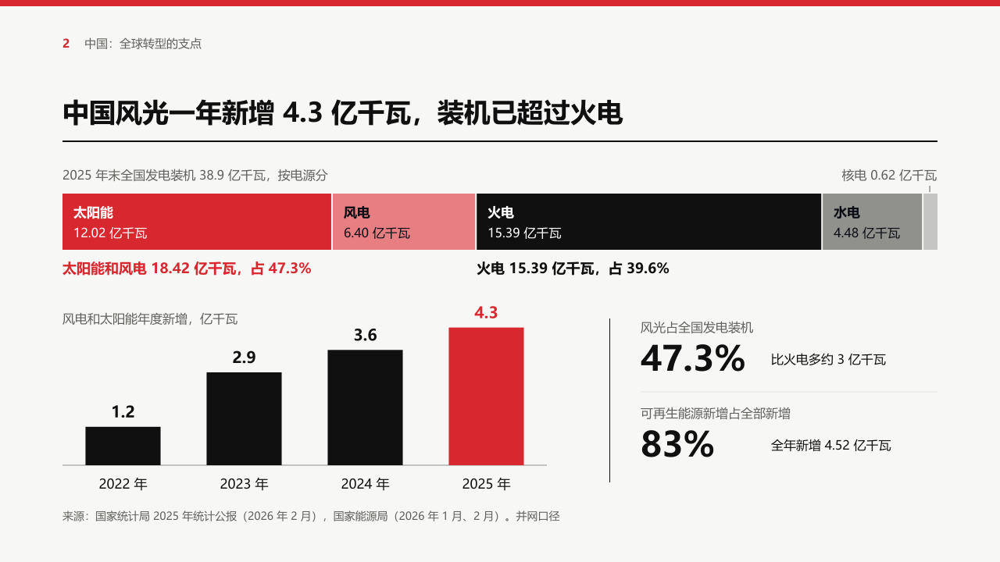

# share

A page that opens on one whole cut into its parts: a share bar across the top of the band, and whatever the page carries after it handed on to the face's other compositions in the band under it.

Code: [`src/layouts/compositions/share.tsx`](../../../src/layouts/compositions/share.tsx). The bar itself is [`src/components/share-bar.tsx`](../../../src/components/share-bar.tsx), which the ordinary chart draws too. Used by swiss and bulletin.

## swiss, power sample, 2026-10

The round's decisions are in [rounds/2026-10-03-swiss](../../rounds/2026-10-03-swiss/README.md).

| board (p08) | engine |
| :-: | :-: |
|  |  |

**What it looks like.** A stacked chart with `direction: "horizontal"` and one category: the category's name is the caption at 16px muted, the bar is 72px tall across the band from y248, each part in the author's order, 2px apart, with its name at 17px bold and its value and unit at 16px inside it. A marked run of adjacent parts (`emphasis` on each series) takes the accent, each further part of it 40% lighter, and the other parts black, the mid grey and the light grey in turn. Under the bar at 18px bold, the run's total and share of the whole under its left end in the accent, and the largest other part's total and share under its own left end in black. The rest of the page (here a column chart of yearly additions and two figures) goes to the face's compositions 36px under the totals: [`rail`](../rail/) sets it, with its figures beside their notes because the band is short.

**Why.** "Wind and solar now exceed thermal" is a comparison of two parts of one whole. A share bar shows the whole and the two parts at once, and the totals line states the comparison the title makes.

**What it gave up.**

- A part's label sits in whichever ink reads on its fill at 4.5:1. The board set white on the light red and the mid grey, which do not reach it, so those labels are black.
- A part too narrow for its label (nuclear, 0.62) gets it over the bar's end, right-aligned to the part, with a short tick down to it. The board left that value out, and a value an author wrote cannot vanish.
- The run's total names its parts in the order they stand: 「太阳能和风电」 where the board wrote 「风电和太阳能」.
- The second total is the largest unmarked part, not a pick of the author's. A totals line with no room for it leaves it out, since both totals are computed.
- Values are never negative and no part is a forecast: a share has no way to show either, and validate refuses both.
