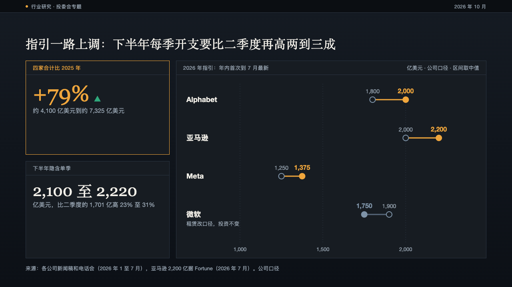
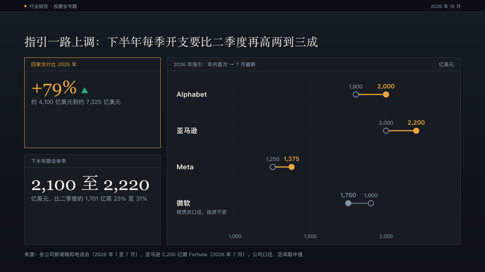

# shifts

A dumbbell chart in a panel: each row a move from a first value to a later one on a shared scale, the rises in the mark.

Code: [`src/layouts/compositions/shifts.tsx`](../../../src/layouts/compositions/shifts.tsx). The header comment there is the contract. The panel setting only. `rail` sets it beside figure panels through `chartPanel` in [`rail-panel.tsx`](../../../src/layouts/compositions/rail-panel.tsx).

## ledger, AI capex sample, 2026-10

Settled on the guidance page, beside two figure panels. The round's decisions are in [rounds/2026-10-04-ledger](../../rounds/2026-10-04-ledger/README.md).

| board (p05) | engine |
| :-: | :-: |
|  |  |

**What it looks like.** One row per category. The first value is a hollow ring, the later one a filled dot joined to it by a line, each with its figure over it. A row that rose is amber with the later figure bold, a row that fell steps back to the quiet slate (`#7E93A8` on ledger). Dotted gridlines and their ticks stand under the rows. The panel is named by the values' title and the move ("2026 年指引：年内首次 → 7 月最新"), with the unit on the right. A category written with a parenthesis sets what the parenthesis says in small type under the name ("租赁改口径，投资不变").

**Why.** Guidance moved four times this year, and the page is about which way. A dot plot shows each move's size and direction on one scale, where a table of two columns makes the reader subtract.

**What it gave up.**

- Two series over two to six categories, every value at or above zero, no `y_title`.
- A fall is never red here: on this page the story is the rises, and red would turn a restatement into an alarm.
- The panel's name is built from the chart's own fields, so it reads "→" where the board wrote 「到」.
