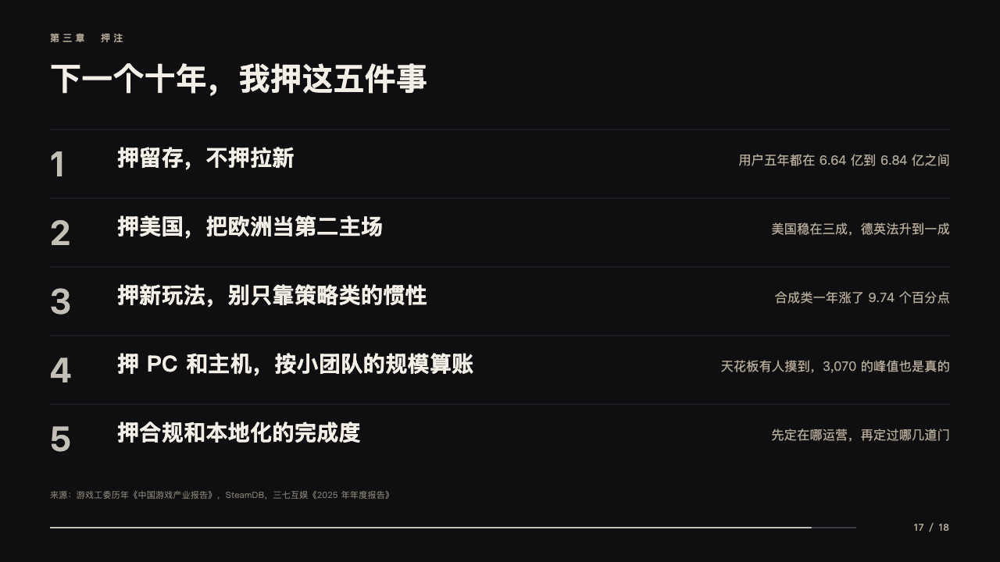
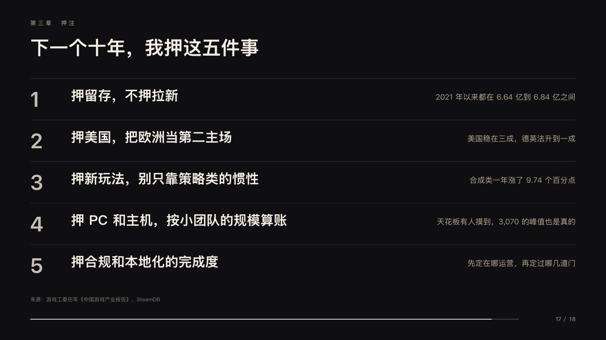

# slate

A short list said one line at a time.

Code: [`src/layouts/compositions/slate.tsx`](../../../src/layouts/compositions/slate.tsx). The header comment there is the contract. The keynote setting only.

## stage, game developers keynote sample, 2026-10

Settled on p17. The round's decisions are in [2026-10-08-stage](../../rounds/2026-10-08-stage/README.md).

| board (p17) | engine |
| :-: | :-: |
|  |  |

**What it looks like.** Three to six rows under hairlines from y166 every 88px: a number bold at 44px in silver, one judgement bold at 28px from x150, and its reason at 16px in the sand ending at x1216. When the author marks one row its number alone is silver and the others are the dim sand.

**Why.** Five bets, each a line the speaker can say and the room can repeat.

**What it gave up.**

- Takes a `numbered_cards` of three to six items with no icon and no sub. A judgement and its reason share one line or the page goes to the ordinary renderer.
