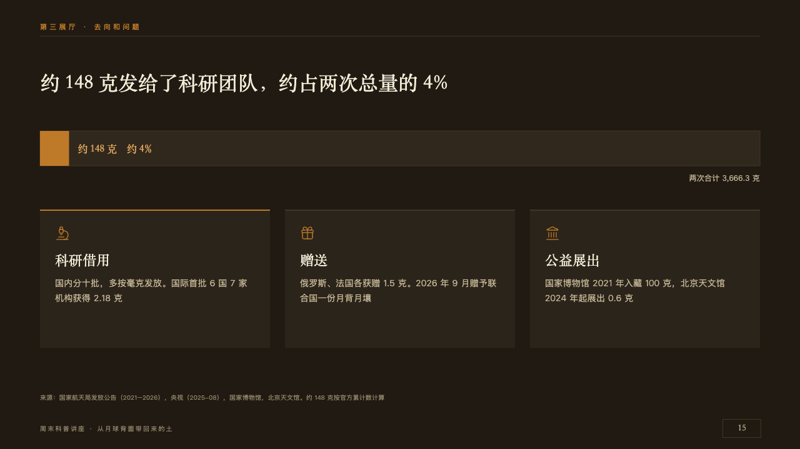
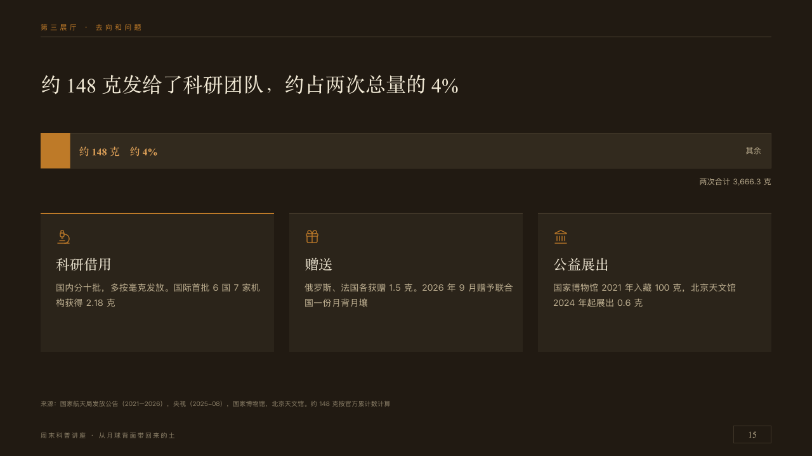

# slice

A whole with its part cut out, beside where it went.

Code: [`src/layouts/compositions/slice.tsx`](../../../src/layouts/compositions/slice.tsx). The header comment there is the contract. The placard setting only.

## museum, Moon soil science talk sample, 2026-10

Settled on p15. The round's decisions are in [2026-10-08-museum](../../rounds/2026-10-08-museum/README.md).

| board (p15) | engine |
| :-: | :-: |
|  |  |

**What it looks like.** The claim over the page. One case-dark bar 56px tall across the measure, the marked part at its start in copper to scale, the author's line for it at 16px bold in the serif in the lit copper beside it, the rest's name small inside the bar at its end, and the whole named at 12px under the bar at the right. Under it a label for each way the whole went, a board 220px tall with a 2px seam along its top (copper on the label named as the marked part), its icon in copper, its name at 22px in the serif and what it holds at 14/24 in old paper.

**Why.** About 148 grams of 3,666.3 is a sliver: drawing it to scale says what four percent means.

**What it gave up.**

- Takes a share bar (`stacked`, `horizontal`, one category, two parts, the first marked, an `emphasis_label`) and an `icon_cards` of two to four, one titled as the marked part.
- The rest is named inside the bar, which the board left unnamed.
