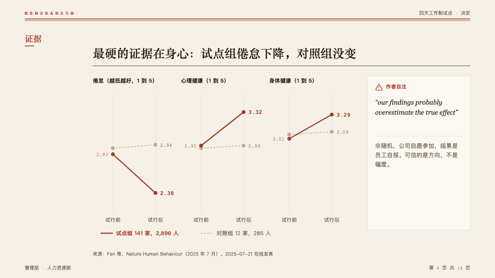
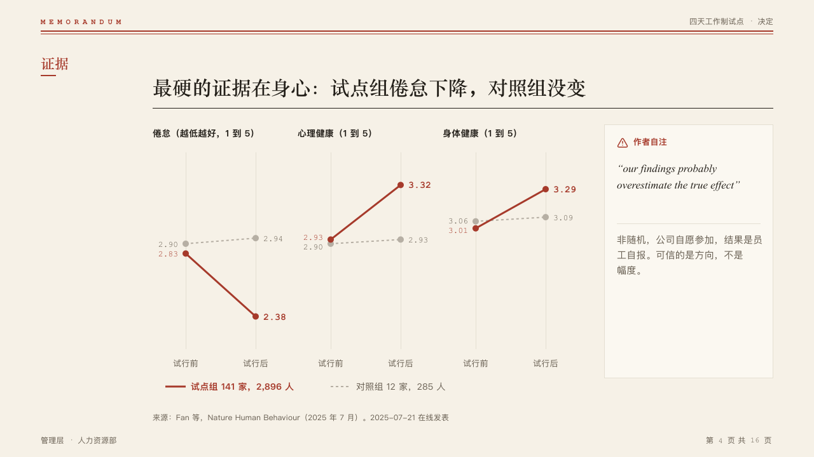

# slopes

Two moments, two groups, a few measures, as slope charts side by side, with an optional note panel.

Code: [`src/layouts/compositions/slopes.tsx`](../../../src/layouts/compositions/slopes.tsx).

## memo, four-day week decision sample, 2026-10

Settled on the wellbeing page (p04). The round's decisions are in [rounds/2026-10-05-memo](../../rounds/2026-10-05-memo/README.md).

| board (p04) | engine |
| :-: | :-: |
|  |  |

**What it looks like.** One 228px panel a measure, named by its value axis title at 14px. The moment before at the left, the moment after at the right, each group a line between its two values on one scale across every panel. The marked series is a solid line in the mark with both values in bold mono, the other a dashed quiet line with its values in muted mono, printed at the decimals the author wrote and pushed apart when they are close. A legend under the panels. Beside them a 266px note panel: its label and icon in the mark, a quoted original in italic in the heading face over a rule, then the note.

**Why.** Before and after for a trial group and a control group is the whole argument, and a steeper line is a bigger change only when the panels share a scale.

**What it gave up.**

- Two to four `line` charts of exactly the same two categories and the same one or two series, with no x title, unit, bands or changes.
