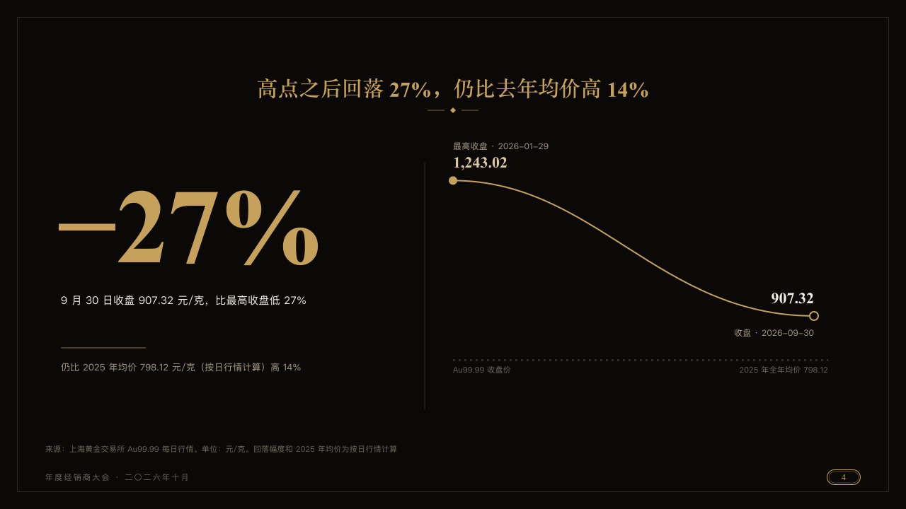

# solo

One figure is the page, and a drawing beside it says how it came about.

Code: [`src/layouts/compositions/solo.tsx`](../../../src/layouts/compositions/solo.tsx). The header comment there is the contract. The invitation setting only.

## luxe, gold dealer conference sample, 2026-10

Settled on p04. The round's decisions are in [2026-10-08-luxe](../../rounds/2026-10-08-luxe/README.md).

| board (p04) | engine |
| :-: | :-: |
|  |  |

**What it looks like.** The claim centred over the page. At the left the figure set at 150px in gold in the serif, its symbol hung on it at half its size, what it is under it in ivory, a short gold rule and its note in old gold. A hairline down the page, x600 beside a line and x530 beside pairs of bars, and the drawing at its right handed on to `descent` or `doubles`.

**Why.** A page that turns on one figure sets it as large as the card allows. The drawing beside it is the evidence, not the point.

**What it gave up.**

- Takes a `kpi_cards` of one figure with no icon, delta, tag, tone or source, then one component a composition in the same setting draws beside it.
- A figure, label or note past its column, or a drawing nothing takes, sends the page back.
