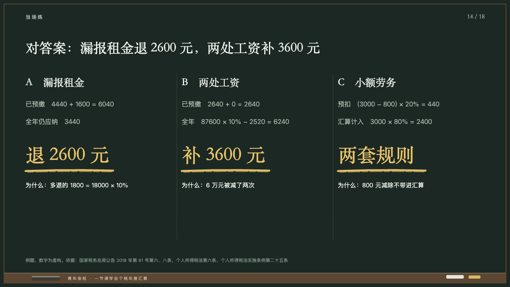
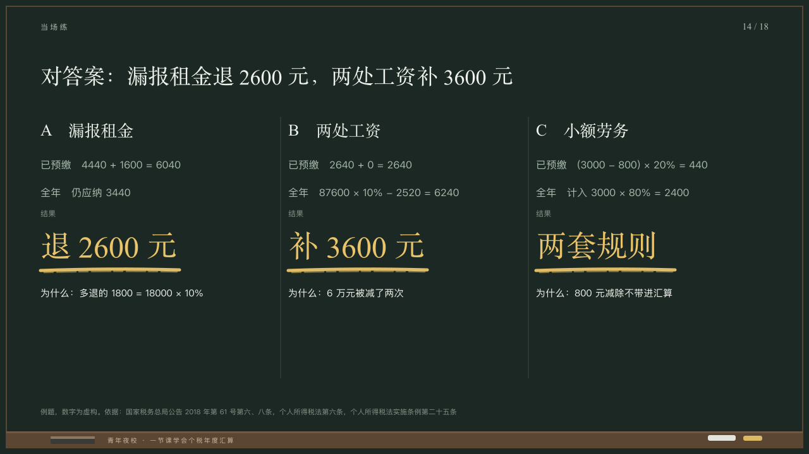

# solutions

The answers worked down the board in columns.

Code: [`src/layouts/compositions/solutions.tsx`](../../../src/layouts/compositions/solutions.tsx). The header comment there is the contract. The chalkboard setting only.

## lecture, annual tax reconciliation evening class sample, 2026-10

Settled on p14. The round's decisions are in [2026-10-08-lecture](../../rounds/2026-10-08-lecture/README.md).

| board (p14) | engine |
| :-: | :-: |
|  |  |

**What it looks like.** One column a question, 24px apart, divided by hairlines from y186 to y600: its letter and name at 26/40 in the serif, the working one line a row at 16/34 in the grey (the row's label and its cell), the result row's label small, the result at 48/70 in yellow in the serif with one stroke of yellow chalk under it, and why at 15/25 in chalk white.

**Why.** The answers come back in the same order as the questions, each worked to its result.

**What it gave up.**

- Takes a `comparison` of two to four columns and two to five rows, exactly one row marked as the result, at most two rows before it and two after. The result row's label stands small over the result, which the board left off.
