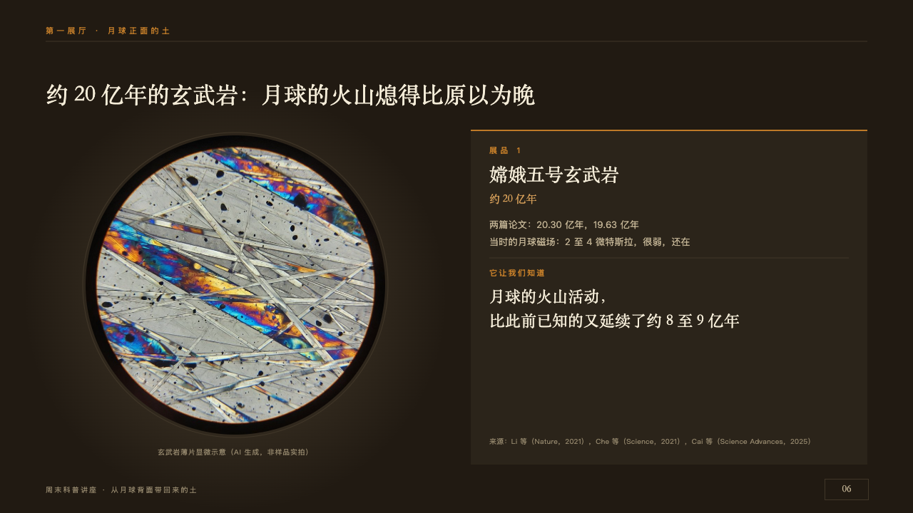
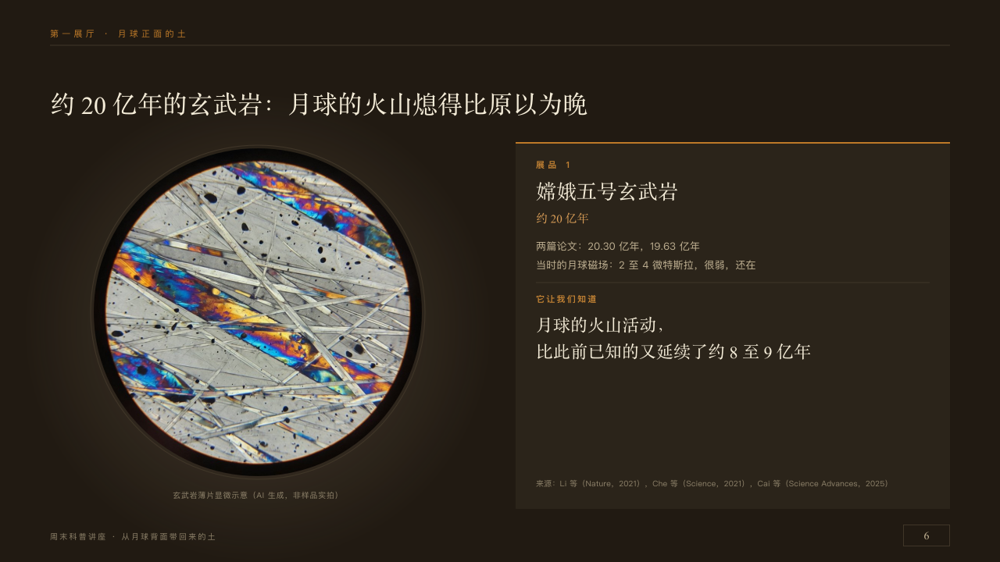

# specimen

One exhibit in its pool of light beside its label.

Code: [`src/layouts/compositions/specimen.tsx`](../../../src/layouts/compositions/specimen.tsx). The header comment there is the contract. The placard setting only.

## museum, Moon soil science talk sample, 2026-10

Settled on p06. The round's decisions are in [2026-10-08-museum](../../rounds/2026-10-08-museum/README.md).

| board (p06) | engine |
| :-: | :-: |
|  |  |

**What it looks like.** The claim over the page. At the left the exhibit's photograph cut round, 420px across from x120, y190, in a pool of warm light 300px in radius at 20%, a seam drawn round it, its caption small under it. At the right the label, a board 556 by 470 at x660, y182 with a 2px copper edge along its top: the number at 11px in copper tracked 4px, the name at 26/36 in the serif, the age at 15px in the lit copper, up to three facts at 13/22 in old paper, a seam, the label of the line it reads aloud at 11px in copper tracked 2px and the line at 22/34 in the serif, broken at its comma, and the source at the label's foot.

**Why.** Every exhibit in a museum is read the same way: the object under a lamp, its label beside it, what it taught us in one sentence.

**What it gave up.**

- Takes an `image`, a `kpi_cards` of one (its `tag` the number, its value and unit the age, its label the name), optionally a `bullets` of up to three facts and a `paragraph` that may open with a short label and a colon.
- The photograph is cut by a clip of one circle, exported as an oval picture.
- A line past three lines, or one that would run into the source, sends the page back.
