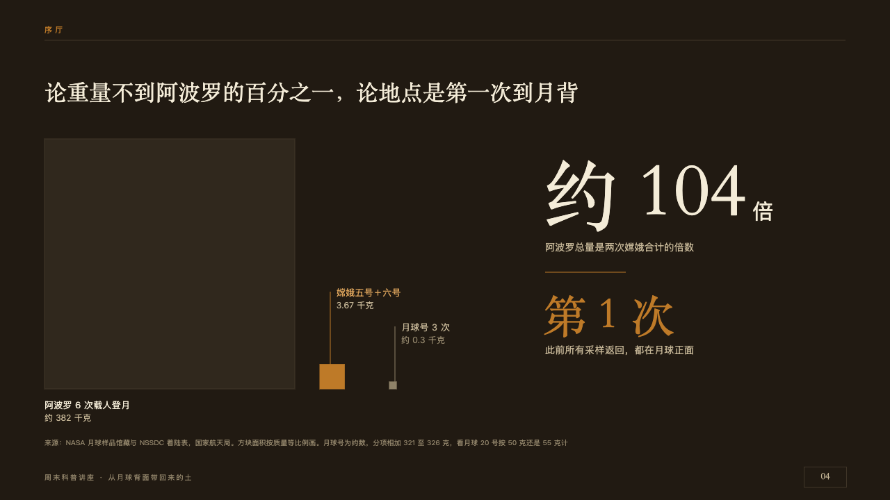
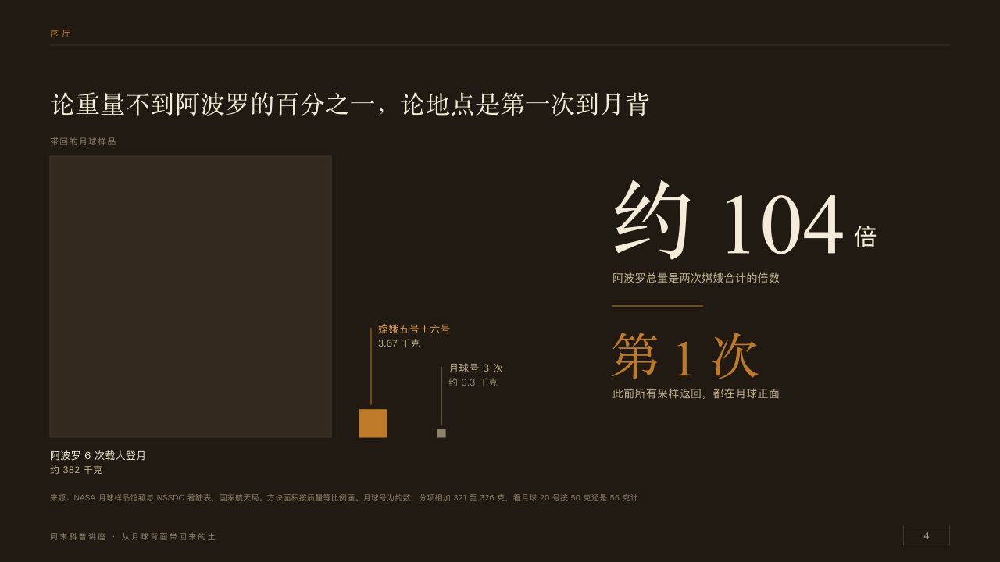

# squares

Quantities as squares whose areas are to scale.

Code: [`src/layouts/compositions/squares.tsx`](../../../src/layouts/compositions/squares.tsx). The header comment there is the contract. The placard setting only.

## museum, Moon soil science talk sample, 2026-10

Settled on p04. The round's decisions are in [2026-10-08-museum](../../rounds/2026-10-08-museum/README.md).

| board (p04) | engine |
| :-: | :-: |
|  |  |

**What it looks like.** The claim over the page. What the squares count small over them on y172. The largest quantity a case-dark square 360px a side on a floor at y560 from x64, a seam round it, its name and amount under it. The others stand on the same floor from x460, 100px apart, at the same scale, the marked one copper and the rest dim, each named at the end of a thin line rising from it, staggered 50px. At the right one figure at 110px in the serif with its unit at 30px and its line, a copper seam, and a second at 64px, copper when marked, with its line.

**Why.** Under one percent of Apollo's haul cannot be drawn as a bar beside it, but it can be drawn as an area.

**What it gave up.**

- Takes a bar `chart` of one series, the largest first, two to four values each with a `note` for its amount as it should read, and a `kpi_cards` of one or two.
- The series' name, what the squares count, is set small over them, which the board left off.
- A figure too wide for its column gives up to three tenths of its size.
