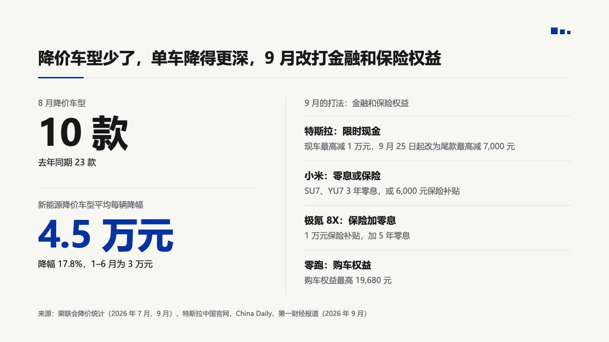

# stack

Two or three headline figures stacked on the left, and beside them, right of a hairline, a titled list of points, each a bold line over a muted one.

Code: [`src/layouts/compositions/stack.tsx`](../../../src/layouts/compositions/stack.tsx). The header comment there is the contract.

## bulletin, NEV sample, 2026-10

Settled on the pricing page. The round's decisions are in [rounds/2026-10-03-bulletin](../../rounds/2026-10-03-bulletin/README.md).

| board (p08) | engine |
| :-: | :-: |
|  |  |

**What it looks like.** Each figure has a 17px label over it, the value at 76px bold, and an 18px note under it, 214px apart with a hairline between them. The figure whose value the author wraps in `**…**` is primary, the others black. Right of a hairline at 520px, the panel's title sits at 17px muted, then each row is a 20px bold line over a 17px muted line, with a hairline over every row.

**Why.** Two numbers say what changed and the list says what competitors did about it. Putting them side by side keeps cause and response on one page without a chart.

**What it gave up.**

- `[kpi_cards, insight_panel]` only: two or three figures with no delta, icon or source, and a panel with no footnote.
- The band must be at least 960px wide.
