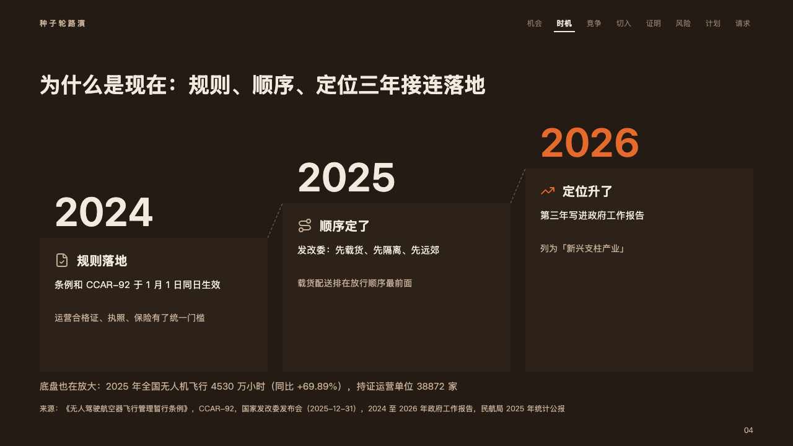
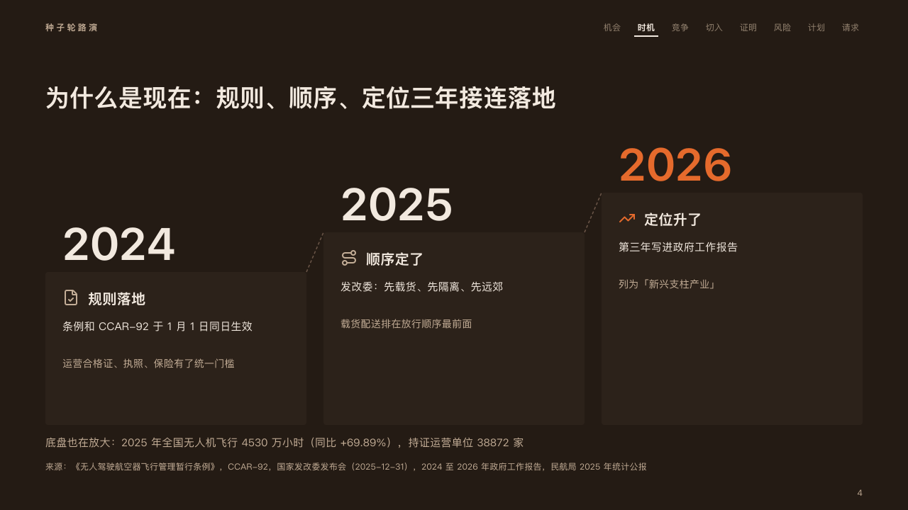

# stairs

Why now, as steps that climb: a card a year, each a step higher than the one before.

Code: [`src/layouts/compositions/stairs.tsx`](../../../src/layouts/compositions/stairs.tsx). The header comment there is the contract. The pitch setting only.

## ember, low-altitude delivery pitch sample, 2026-10

Settled on the why-now page (p04). The round's decisions are in [rounds/2026-10-06-ember](../../rounds/2026-10-06-ember/README.md).

| board (p04) | engine |
| :-: | :-: |
|  |  |

**What it looks like.** Two to four cards side by side, each standing 56px higher than the one before it and joined to it by a dashed riser, the year set at 64px over the card. The year the page lands on (`highlight`) takes the fire for its figure and its icon. On a card its icon and what changed that year bold at 20px, then the fact at 15px in the ivory and what it means at 14px in the warm grey: the milestone's `desc` split at its first sentence end. Under the stairs one line at 15px in the warm grey on what the climb stands on (the callout).

**Why.** "Why now" argues that each year made the next possible. A climb says so before a card is read, and the lit year says where it lands.

**What it gave up.**

- A horizontal `timeline` of two to four milestones with no lane, period, tag, source or tone, at most one highlighted, then optionally a `callout` with no title, tag or icon.
- The sentence end between the fact and what it means is not printed. It is recorded on the fact's last line (`data-gloss-break`).
- A year wider than its card, a title past one line, a fact or what it means past two lines, or a closing line past two lines sends the page back.
