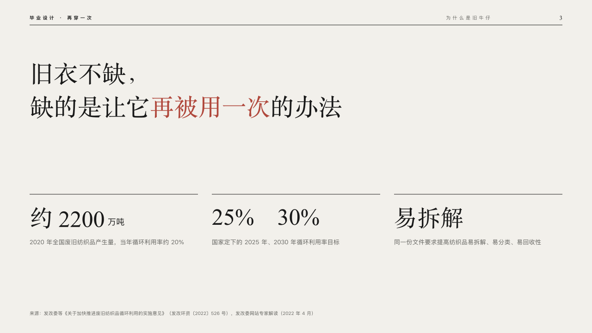

# standfirst

An editor's standfirst over the figures it rests on.

Code: [`src/layouts/compositions/standfirst.tsx`](../../../src/layouts/compositions/standfirst.tsx). The header comment there is the contract. The lineup setting only.

## runway, graduation collection review sample, 2026-10

Settled on p03. The round's decisions are in [2026-10-08-runway](../../rounds/2026-10-08-runway/README.md).

| board (p03) | engine |
| :-: | :-: |
|  |  |

**What it looks like.** The claim set large, 52/72 in the serif from y120, on the lines the author broke it into, its marked words in crimson. Under it two to four figures in a row, each under a black rule: the figure at 50px in the serif with its unit small after it, and what it counts at 13/22 in the stone grey under it. A figure need not be a number (「易拆解」).

**Why.** A statement page states one sentence and shows what it rests on, the way a magazine's standfirst sits over its facts.

**What it gave up.**

- Takes a `kpi_cards` of two to four items with labels and no icon, delta, tag, tone, note or source.
- A claim past two lines at 52px, a figure wider than its column or a label past two lines sends the page back.
