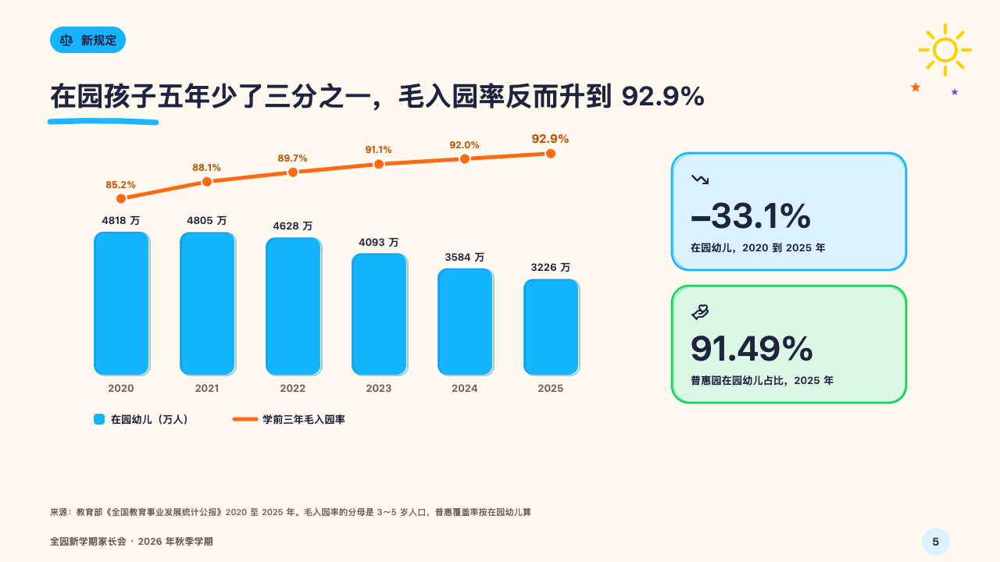
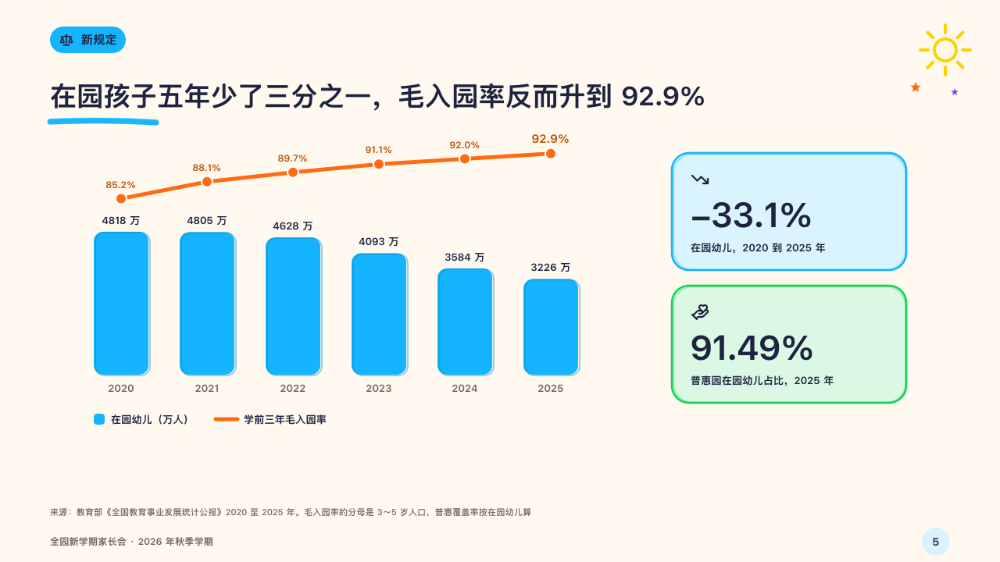

# storeys

A count in bars with a rate over it on a storey of its own, and two figures beside them.

Code: [`src/layouts/compositions/storeys.tsx`](../../../src/layouts/compositions/storeys.tsx). The header comment there is the contract. The crayonbox setting only.

## crayon, new term parents' meeting sample, 2026-10

Settled on p05. The round's decisions are in [2026-10-08-crayon](../../rounds/2026-10-08-crayon/README.md).

| board (p05) | engine |
| :-: | :-: |
|  |  |

**What it looks like.** Sky-blue bars 70px wide on a lower storey, each with an outline traced a little off in the deeper blue and its value over it (13px with the axis unit). The rate runs as a 5px tangerine line on an upper storey of its own, every point named with its value in the burnt orange and the last one larger, so the two never cross. A key under the bars names both. Beside them two cards drawn by hand, sky and green, each a figure (44px) with its symbol and what it counts.

**Why.** Fewer children and a higher enrolment rate are two scales on one page, and setting them on separate storeys keeps a parent from reading one against the other's axis.

**What it gave up.**

- Takes an untitled `combo` chart of one bar series and one line series on the right axis over the same three to eight categories, every value at zero or above, then a `kpi_cards` of two with symbols and labels.
- A chart with a tag, a reference, statuses, notes, marks, changes or axis titles, a card with a note, a tag, a delta, a tone or a source send the page back.
- A run of values prints with the decimals its most precise value was written with (92.0%, not 92%).
