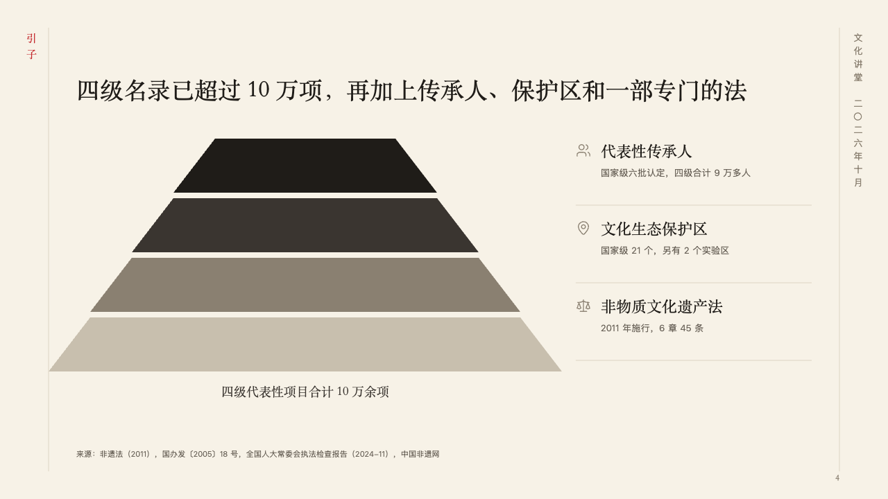
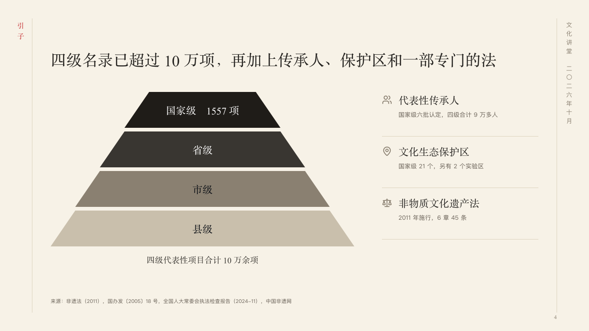

# strata

A system of tiers as a pyramid, beside the other parts of the system.

Code: [`src/layouts/compositions/strata.tsx`](../../../src/layouts/compositions/strata.tsx). The header comment there is the contract. The scroll setting only.

## ink, intangible heritage public lecture sample, 2026-10

Settled on p04. The round's decisions are in [2026-10-07-ink](../../rounds/2026-10-07-ink/README.md).

| board (p04) | engine |
| :-: | :-: |
|  |  |

**What it looks like.** The claim over the page. At the left a pyramid of three to six tiers 78px tall on an 86px pitch, the top in burnt ink and each one below a step paler, each tier's name in its band with the figure it holds after it (the layer's `note`, 「国家级　1557 项」), in white or the ink, whichever reads at 4.5:1. Under the pyramid a line in the heading face that sums it up. At the right the other parts of the system as ruled rows: a symbol, the part's name in the heading face, and what it is in the grey.

**Why.** A system of lists is read from the top down, and the people, the places and the law that stand beside the lists belong to the same system, so they stand beside the pyramid rather than under it.

**What it gave up.**

- Takes a `pyramid` of three to six layers, an `icon_cards` of two to four items each with a symbol, then optionally a `paragraph` (the line under the pyramid).
- A layer with a tone, cards with a title over them, a card with a tone or a tag, or a name or line past its room sends the page back.
- The pyramid is scaled to the measure's left 660px, so a pyramid never crosses the scroll's edge.
