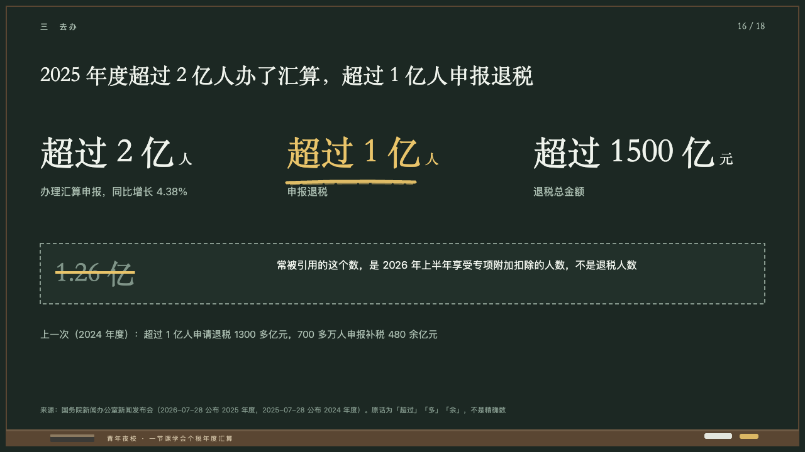
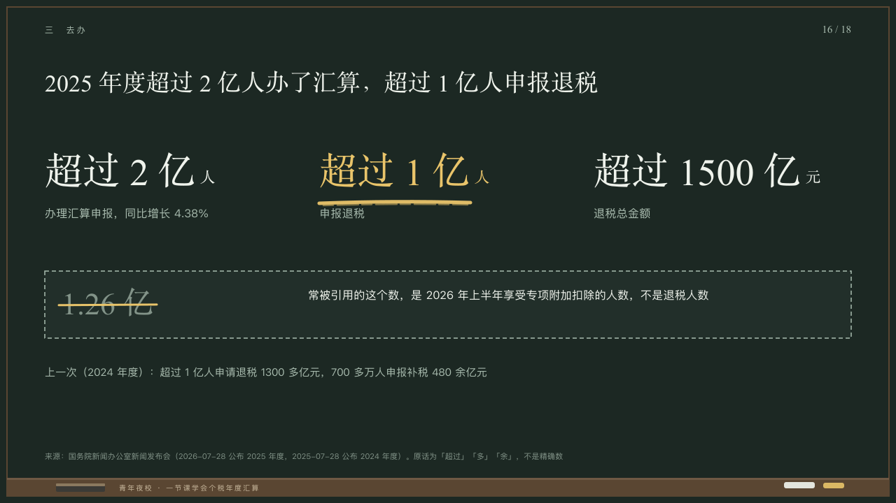

# strikeout

Figures, and the misquoted one struck out.

Code: [`src/layouts/compositions/strikeout.tsx`](../../../src/layouts/compositions/strikeout.tsx). The header comment there is the contract. The chalkboard setting only.

## lecture, annual tax reconciliation evening class sample, 2026-10

Settled on p16. The round's decisions are in [2026-10-08-lecture](../../rounds/2026-10-08-lecture/README.md).

| board (p16) | engine |
| :-: | :-: |
|  |  |

**What it looks like.** Two to four figures across the measure from y196 at 54/90 in the serif (smaller together down to 36px when one is wide), each with its unit at 22px after it and its label (and note) at 16/26 in the grey under it. The marked figure is yellow with one stroke of yellow chalk under it. A dashed box of the board from y388: the misquoted figure at 44px in the dim struck with a line of yellow chalk, and beside it at 16/28 what it really counts. A line at 15/26 in the grey under the box.

**Why.** The number people quote wrongly is shown and crossed out, so the class remembers which is which.

**What it gave up.**

- Takes a `kpi_cards` of two to four items, then a warning `callout` whose title is the misquoted figure and whose text says what it counts, then optionally a `paragraph`.
