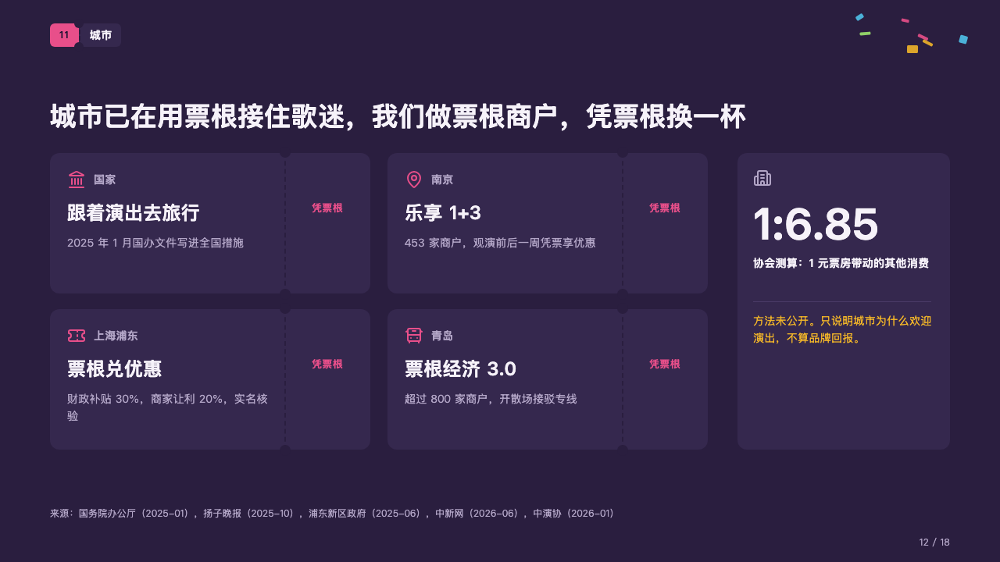
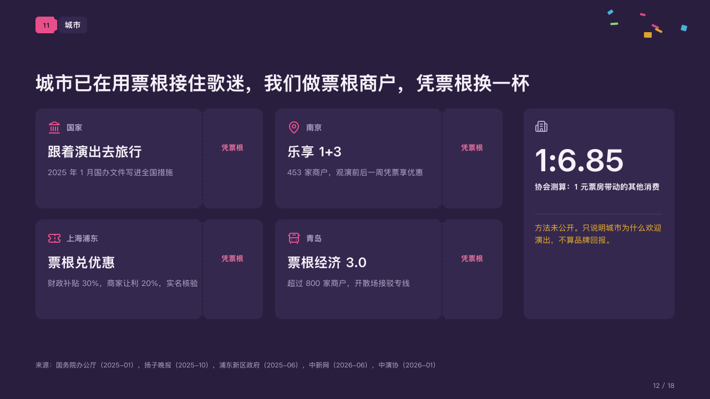

# stubs

Offers a ticket earns, as tickets with a perforated stub, beside the figure that explains them.

Code: [`src/layouts/compositions/stubs.tsx`](../../../src/layouts/compositions/stubs.tsx). The header comment there is the contract. The marquee setting only.

## rally, summer concert season proposal sample, 2026-10

Settled on the cities page (p12). The round's decisions are in [rounds/2026-10-06-rally](../../rounds/2026-10-06-rally/README.md).

| board (p12) | engine |
| :-: | :-: |
|  |  |

**What it looks like.** Two to four tickets two to a row, each a card with a perforated stub at its right: on the ticket the place in small grey type beside its icon in the magenta, the offer's name large and a grey line on what it gives; on the stub, in the magenta, the few words that say what to show for it (the card's tag, 「凭票根」). Beside them a card with a figure, its icon, its label, a hairline and its note, the note in the gold when the figure is one to read with care (`tone: "warning"`).

**Why.** Cities already reward ticket stubs. Drawing each scheme as a ticket says the brand can join them as one more merchant.

**What it gave up.**

- A card's title is written "place：offer" (「南京：乐享 1+3」). The colon is declared on the place's line, not printed.
- An `icon_cards` of two to four, each titled that way with a plain tag; then a `kpi_cards` of one item with no delta, tag or source, its tone none or warning.
- A place or an offer past one line, a line past two, a stub's words past three lines or the figure's words past their lines sends the page back.
