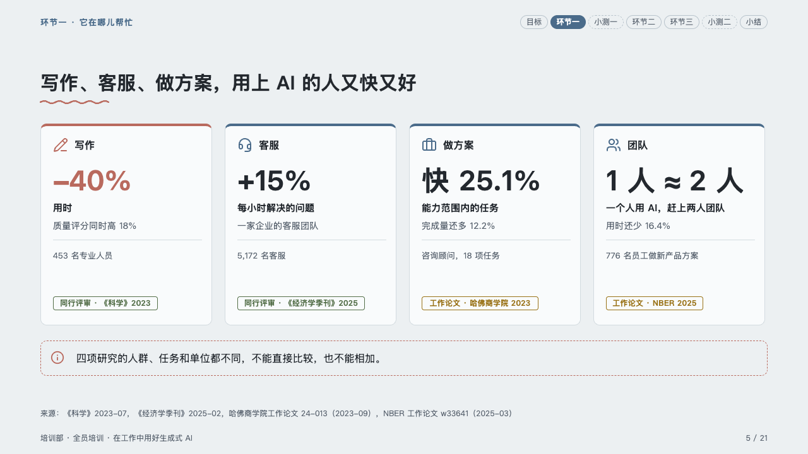
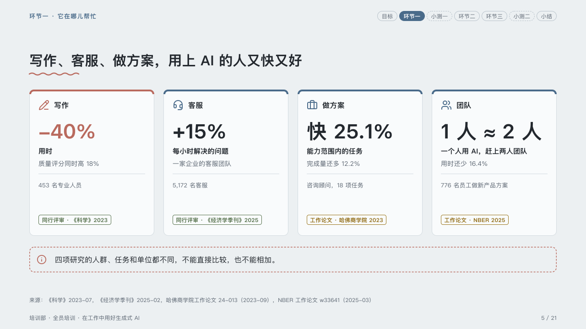

# studies

What each study found, side by side, each with the kind of study it is.

Code: [`src/layouts/compositions/studies.tsx`](../../../src/layouts/compositions/studies.tsx). The header comment there is the contract. The lesson setting only.

## homeroom, AI-at-work training sample, 2026-10

Settled on the four studies page (p05). The round's decisions are in [rounds/2026-10-06-homeroom](../../rounds/2026-10-06-homeroom/README.md).

| board (p05) | engine |
| :-: | :-: |
|  |  |

**What it looks like.** A card per study, 320px tall, its 4px top edge in the mark: its icon and its field at the top (the label before the colon, 「写作」), the figure bold at 44px, what the figure measures bold under it (the label after the colon, 「用时」), the finding muted, a hairline, who was studied (`source`), and at the foot the kind of study as a pill: a journal's (`evidence: "trial"`) in the success ink, a working paper's (`preprint`) or a vendor's (`company`) in the warning ink. The study the page leads with, its figure written `**…**`, takes the pen for its edge and its figure. Under the cards a caution in a dashed outline of the pen.

**Why.** Four studies measured four different things: setting each on its own card, with what it is and how firm it is, keeps the room from adding them up.

**What it gave up.**

- A `kpi_cards` of two to four items with no delta or tone, then optionally a `callout` with no title or tag.
- A figure wider than its card at 44px, or a field, measure, finding or sample past one line, sends the page back.
- The card's sample is the figure's `source`, the line that says who the figure came from.
