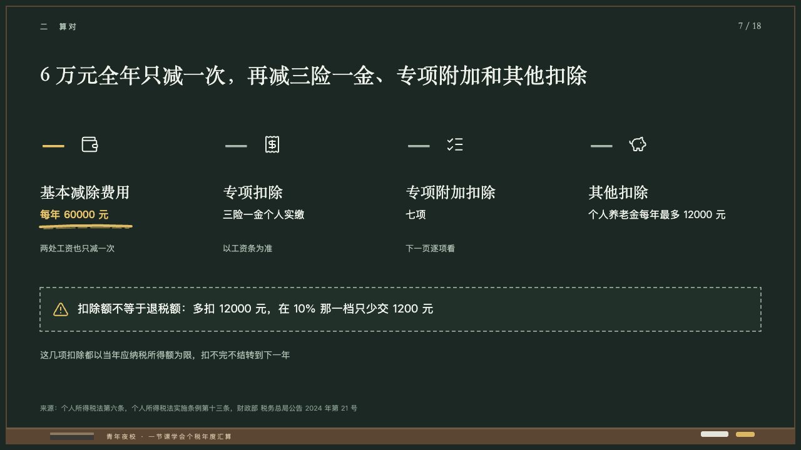
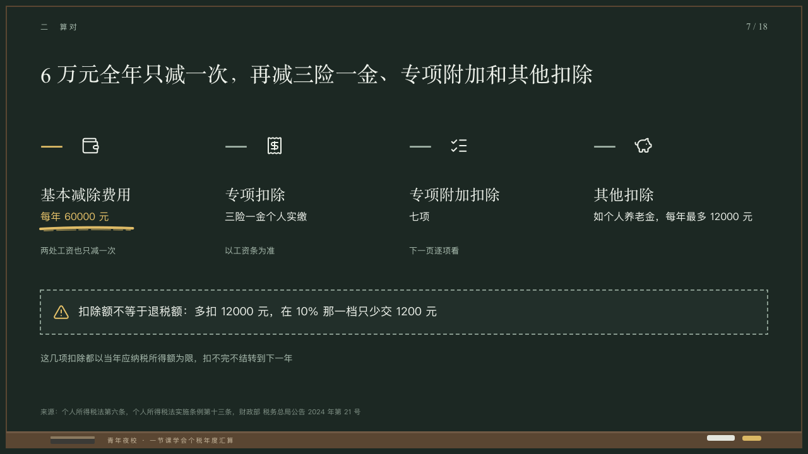

# subtractions

What is taken off, as a row of minus signs.

Code: [`src/layouts/compositions/subtractions.tsx`](../../../src/layouts/compositions/subtractions.tsx). The header comment there is the contract. The chalkboard setting only.

## lecture, annual tax reconciliation evening class sample, 2026-10

Settled on p07. The round's decisions are in [2026-10-08-lecture](../../rounds/2026-10-08-lecture/README.md).

| board (p07) | engine |
| :-: | :-: |
|  |  |

**What it looks like.** Two to five columns 292px apart from y196: a minus sign at 64/70 in the serif in the grey with the item's symbol at 30px in chalk white beside it, the name at 24/34 in the serif from y290, the amount at 16/26 from y330 and a line at 13/22 in the grey from y386. The amount the author marks is yellow with one stroke of yellow chalk under it, and so is its minus sign. A warning in a dashed box of the board from y460 with its symbol in yellow, then a line at 14/24 in the grey.

**Why.** One deduction after another, each a minus sign the class can count.

**What it gave up.**

- Takes a `steps` of two to five items, each an icon, a name and a text whose first line is the amount and whose second, after a line break, the note under it, then optionally a `callout` with an icon and a `paragraph`.
