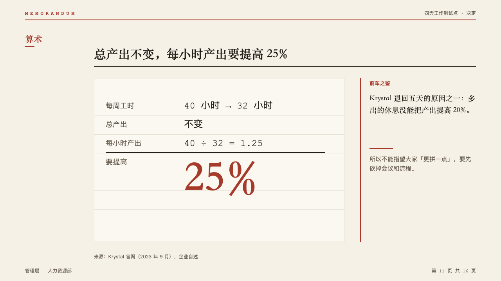
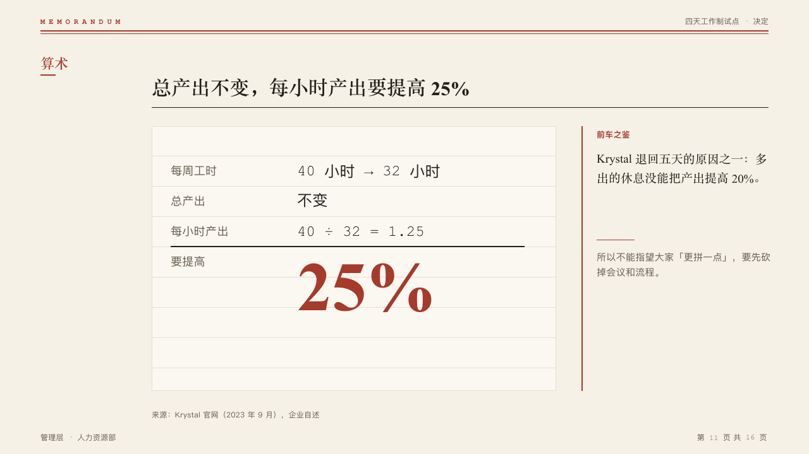

# sum

A sum worked on ruled paper, the answer large in the mark, with an optional note beside the pad.

Code: [`src/layouts/compositions/sum.tsx`](../../../src/layouts/compositions/sum.tsx).

## memo, four-day week decision sample, 2026-10

Settled on the arithmetic page (p11). The round's decisions are in [rounds/2026-10-05-memo](../../rounds/2026-10-05-memo/README.md).

| board (p11) | engine |
| :-: | :-: |
|  |  |

**What it looks like.** A 420px pad of the lifted paper ruled every 48px. Each line of the working is a label in muted mono at 18px and its figures in mono at 24px from x230, one to a ruled line. A 2px rule of ink closes the working, and the answer stands under it at 110px in the heading face in the mark after its label. Beside the pad a note behind a 2px rule of the mark: its label in the mark, what it says in the heading face, a short rule of the mark, then what follows from it in the muted ink.

**Why.** A memo that asks for 25% more output an hour should show the sum, not just the answer.

**What it gave up.**

- A `bullets` of one to four items written "Label: working", a `kpi_cards` of one item, then optionally a callout. A working past one line sends the page back.
