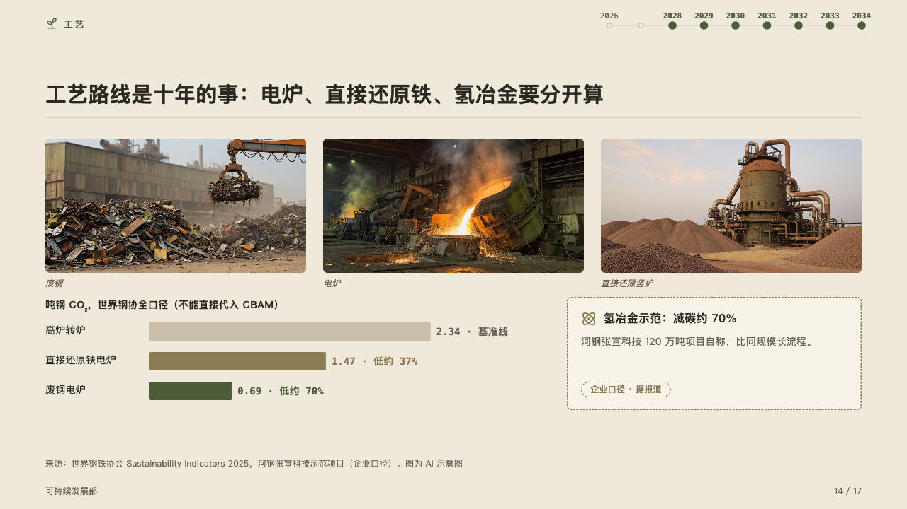
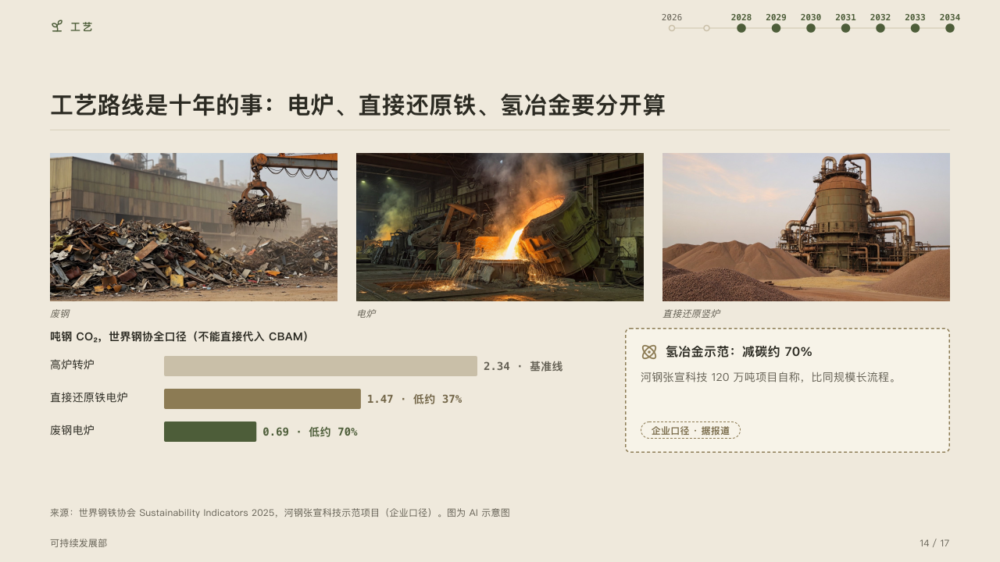

# survey

The ways a thing can be done, each under its photograph, measured on one scale.

Code: [`src/layouts/compositions/survey.tsx`](../../../src/layouts/compositions/survey.tsx). The header comment there is the contract. The yearbook setting only.

## almanac, CBAM sample, 2026-10

Settled on the routes page (p14). The round's decisions are in [rounds/2026-10-05-almanac](../../rounds/2026-10-05-almanac/README.md).

| board (p14) | engine |
| :-: | :-: |
|  |  |

**What it looks like.** The photographs in a row across the band, each its caption in italics under it. Under them on the left the scale's name in bold and a bar for each way: its name, the bar and its value in mono with its note after a middle dot. A short list steps from the ghost through the quiet ink to the mark, the way the page argues for last. On the right a card for the way that is only claimed: edged and dashed in its tag's ink, its icon and title over its text and the tag at its foot.

**Why.** Routes are things a committee pictures before it compares them. The scale says whose count it is (worldsteel's, which cannot be put into the charge), and the claimed figure is kept apart from the measured ones.

**What it gave up.**

- An `image_grid` of two to four photographs with no icon, a `bar` chart on its side of one series of two to five bars, none below zero, and a `callout`.
- A caption past its photograph, a name or a value past its room, a text past its lines, or anything taller than the band sends the page back.
