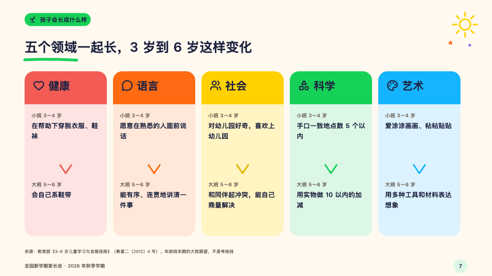
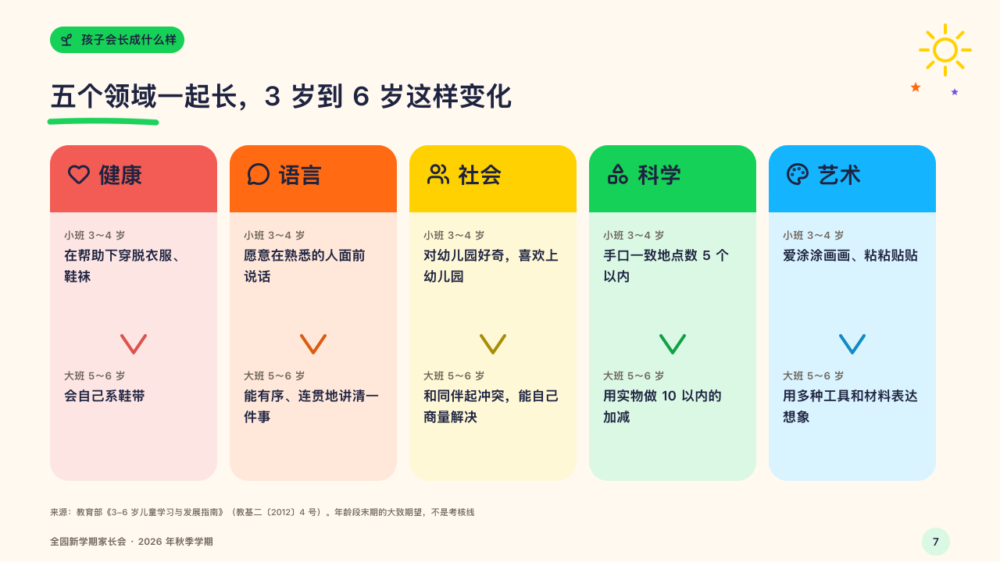

# swatches

How several things change from one stage to the next, a card of its own colour each.

Code: [`src/layouts/compositions/swatches.tsx`](../../../src/layouts/compositions/swatches.tsx). The header comment there is the contract. The crayonbox setting only.

## crayon, new term parents' meeting sample, 2026-10

Settled on p07. The round's decisions are in [2026-10-08-crayon](../../rounds/2026-10-08-crayon/README.md).

| board (p07) | engine |
| :-: | :-: |
|  |  |

**What it looks like.** A tall pale card a thing, 214 by 430, its top a band of the full crayon with the thing's symbol and name (28px). Under it the first stage's name small and grey (「小班 3～4 岁」, the stage's kicker and title) and what the thing looks like then (17/27), a chevron in the card's crayon pointing down, the second stage's name and what it looks like by then, a little heavier. The cards take red, tangerine, yellow, green and sky in turn.

**Why.** Five areas of growth are five different things, and a colour each keeps them apart across the page.

**What it gave up.**

- Takes a `from_to` of three to six rows, every row with a symbol, a label and words for both stages.
- A header over the labels (`label_column`), a span, a row with a note, a unit, a change, a tag or a mark, or words past three lines send the page back.
- In a Latin deck a stage's kicker and title are joined by a middle dot.
